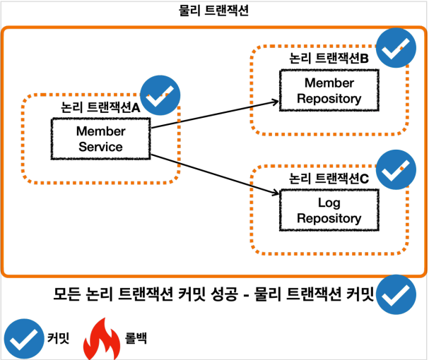
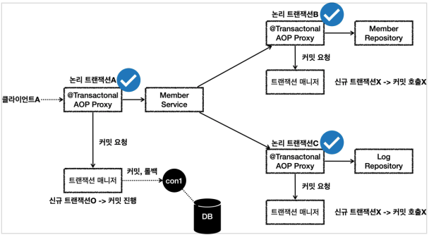
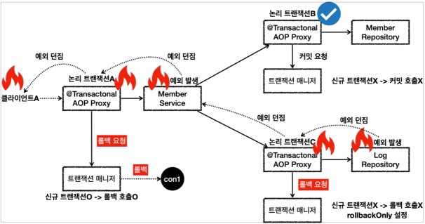

# 스프링 트랜잭션 전파 2 - 활용

## 예제 프로젝트 시작

### 비즈니스 요구사항

* 회원을 등록하고 조회한다.
* 회원에 대한 변경 이력을 추적할 수 있도록 회원 데이터가 변경될 때 변경 이력을 DB LOG 테이블에 남겨야 한다.
    * 여기서는 예제를 단순화 하기 위해 회원 등록시에만 DB LOG 테이블에 남긴다.

### 예제

#### Member

```java
@Entity
@Getter @Setter
@NoArgsConstructor
public class Member {
    @Id
    @GeneratedValue
    private Long id;

    private String username;

    public Member(String username) {
        this.username = username;
    }
}
```

* JPA를 통해 관리하는 회원 엔티티이다.

#### MemberRepository

```java
@Slf4j
@Repository
@RequiredArgsConstructor
public class MemberRepository {
    private final EntityManager em;

    @Transactional
    public void save(Member member) {
        log.info("Member 저장");
        em.persist(member);
    }

    public Optional<Member> find(String username) {
        return em.createQuery("select m from Member m where m.username = :username", Member.class)
                .setParameter("username", username)
                .getResultList().stream().findAny();
    }
}
```

* JPA를 사용하는 회원 리포지토리이다. 저장과 조회 기능을 제공한다.

#### Log

```java
@Entity
@Getter @Setter
@NoArgsConstructor
public class Log {
    @Id
    @GeneratedValue
    private Long id;
    private String message;

    public Log(String message) {
        this.message = message;
    }
}
```

* JPA를 통해 관리하는 로그 엔티티이다.

#### LogRepository

```java
@Slf4j
@Repository
@RequiredArgsConstructor
public class LogRepository {
    private final EntityManager em;

    @Transactional
    public void save(Log logMessage) {
        log.info("Log 저장");
        em.persist(logMessage);

        if (logMessage.getMessage().contains("로그 예외")) {
            log.info("Log 저장시 예외 발생");
            throw new RuntimeException("예외 발생");
        }
    }

    public Optional<Log> find(String message) {
        return em.createQuery("select l from Log l where l.message = :message", Log.class)
                .setParameter("message", message)
                .getResultList().stream().findAny();
    }
}
```

* JPA를 사용하는 로그 리포지토리이다. 저장과 조회 기능을 제공한다.
* 중간에 예외 상황을 재현하기 위해 로그예외 라고 입력하는 경우 예외를 발생시킨다.

#### MemberService

```java
@Slf4j
@Service
@RequiredArgsConstructor
public class MemberService {
    private final MemberRepository memberRepository;
    private final LogRepository logRepository;

    public void joinV1(String username) {
        Member member = new Member(username);
        Log logMessage = new Log(username);

        log.info("== MemberRepository 호출 시작 ==");
        memberRepository.save(member);
        log.info("== MemberRepository 호출 종료 ==");

        log.info("== LogRepository 호출 시작 ==");
        logRepository.save(logMessage);
        log.info("== LogRepository 호출 종료 ==");
    }

    public void joinV2(String username) {
        Member member = new Member(username);
        Log logMessage = new Log(username);

        log.info("== MemberRepository 호출 시작 ==");
        memberRepository.save(member);
        log.info("== MemberRepository 호출 종료 ==");

        log.info("== LogRepository 호출 시작 ==");
        try {
            logRepository.save(logMessage);
        } catch (RuntimeException e) {
            log.info("Log 저장에 실패했습니다. logMessage = {}", logMessage.getMessage());
            log.info("정상 흐름 반환");
        }
        log.info("== LogRepository 호출 종료 ==");
    }
}
```

* 회원을 등록하면서 동시에 회원 등록에 대한 DB 로그도 함께 남긴다.
* `joinV1()`
    * 회원과 DB로그를 함께 남기는 비즈니스 로직이다.
    * 현재 별도의 트랜잭션은 설정하지 않는다.
* `joinV2()`
    * `joinV1()` 과 같은 기능을 수행한다.
    * DB로그 저장시 예외가 발생하면 예외를 복구한다.
    * 현재 별도의 트랜잭션은 설정하지 않는다.

#### MemberServiceTest

```java
@Slf4j
@SpringBootTest
class MemberServiceTest {
    @Autowired
    MemberService memberService;

    @Autowired
    MemberRepository memberRepository;

    @Autowired
    LogRepository logRepository;

    /**
     * MemberService    @Transactional:OFF
     * MemberRepository @Transactional:ON
     * LogRepository    @Transactional:ON
     */
    @Test
    void outerTxOff_success() {
        // given
        String username = "outerTxOff_success";

        // when
        memberService.joinV1(username);

        // then
        assertTrue(memberRepository.find(username).isPresent());
        assertTrue(logRepository.find(username).isPresent());
    }
}
```

### 참고

* JPA의 구현체인 하이버네이트가 테이블을 자동으로 생성해준다.
* 메모리 DB이기 때문에 모든 테스트가 완료된 이후에 DB는 사라진다.
* 여기서는 각각의 테스트가 완료된 시점에 데이터를 삭제하지 않는다.
    * 따라서 username 은 테스트별로 각각 다르게 설정해야 한다.
    * 그렇지 않으면 다음 테스트에 영향을 준다.
    * 모든 테스트가 완료되어야 DB가 사라진다.

#### JPA와 데이터 변경

* JPA를 통한 모든 데이터 변경(등록, 수정, 삭제)에는 트랜잭션이 필요하다.
    * 조회는 트랜잭션 없이 가능하다.
    * 현재 코드에서 서비스 계층에 트랜잭션이 없기 때문에 리포지토리에 트랜잭션이 있다

## 커밋, 롤백

### 서비스 계층에 트랜잭션이 없을 때 - 커밋

#### 상황

* 서비스 계층에 트랜잭션이 없다.
* 회원, 로그 리포지토리가 각각 트랜잭션을 가지고 있다.
* 회원, 로그 리포지토리 둘다 커밋에 성공한다.

#### outerTxOff_success

```java
/**
 * MemberService    @Transactional:OFF
 * MemberRepository @Transactional:ON
 * LogRepository    @Transactional:ON
 */
@Test
void outerTxOff_success() {
    // given
    String username = "outerTxOff_success";

    // when
    memberService.joinV1(username);

    // then
    assertTrue(memberRepository.find(username).isPresent());
    assertTrue(logRepository.find(username).isPresent());
}
```

#### 결과 로그

```
# TEST.outerTxOff_success 시작
# MemberService.joinV1 호출
h.springdb22.propagation.MemberService   : == MemberRepository 호출 시작 ==

# MemberRepository.save 호출
# 트랜잭션 시작
o.s.orm.jpa.JpaTransactionManager        : Creating new transaction with name [hello.springdb22.propagation.MemberRepository.save]: PROPAGATION_REQUIRED,ISOLATION_DEFAULT
o.s.orm.jpa.JpaTransactionManager        : Opened new EntityManager [SessionImpl(1026471930<open>)] for JPA transaction
o.s.orm.jpa.JpaTransactionManager        : Exposing JPA transaction as JDBC [org.springframework.orm.jpa.vendor.HibernateJpaDialect$HibernateConnectionHandle@74a03bd5]
o.s.t.i.TransactionInterceptor           : Getting transaction for [hello.springdb22.propagation.MemberRepository.save]
h.s.propagation.MemberRepository         : Member 저장

# em.persist 호출
org.hibernate.SQL                        : select next value for member_seq

# MemberRepository.save 호출 종료
# 트랜잭션 마무리 작업 시작 - COMMIT
o.s.t.i.TransactionInterceptor           : Completing transaction for [hello.springdb22.propagation.MemberRepository.save]
o.s.orm.jpa.JpaTransactionManager        : Initiating transaction commit
o.s.orm.jpa.JpaTransactionManager        : Committing JPA transaction on EntityManager [SessionImpl(1026471930<open>)]

# 실제 INSERT 문 보냄
org.hibernate.SQL                        : insert into member (username, id) values (?, ?)
org.hibernate.orm.jdbc.bind              : binding parameter [1] as [VARCHAR] - [outerTxOff_success]
org.hibernate.orm.jdbc.bind              : binding parameter [2] as [BIGINT] - [1]

# 트랜잭션 마무리 작업 종료
o.s.orm.jpa.JpaTransactionManager        : Closing JPA EntityManager [SessionImpl(1026471930<open>)] after transaction

# MemberService.joinV1 다시 돌아옴
h.springdb22.propagation.MemberService   : == MemberRepository 호출 종료 ==
h.springdb22.propagation.MemberService   : == LogRepository 호출 시작 ==

# LogRepository.save 호출
# 트랜잭션 시작
o.s.orm.jpa.JpaTransactionManager        : Creating new transaction with name [hello.springdb22.propagation.LogRepository.save]: PROPAGATION_REQUIRED,ISOLATION_DEFAULT
o.s.orm.jpa.JpaTransactionManager        : Opened new EntityManager [SessionImpl(1784425773<open>)] for JPA transaction
o.s.orm.jpa.JpaTransactionManager        : Exposing JPA transaction as JDBC [org.springframework.orm.jpa.vendor.HibernateJpaDialect$HibernateConnectionHandle@1dadd172]
o.s.t.i.TransactionInterceptor           : Getting transaction for [hello.springdb22.propagation.LogRepository.save]
h.springdb22.propagation.LogRepository   : Log 저장

# em.persist 호출
org.hibernate.SQL                        : select next value for log_seq

# LogRepository.save 호출 종료
# 트랜잭션 마무리 작업 시작 - COMMIT
o.s.t.i.TransactionInterceptor           : Completing transaction for [hello.springdb22.propagation.LogRepository.save]
o.s.orm.jpa.JpaTransactionManager        : Initiating transaction commit
o.s.orm.jpa.JpaTransactionManager        : Committing JPA transaction on EntityManager [SessionImpl(1784425773<open>)]

# 실제 INSERT 문 보냄
org.hibernate.SQL                        : insert into log (message, id) values (?, ?)
org.hibernate.orm.jdbc.bind              : binding parameter [1] as [VARCHAR] - [outerTxOff_success]
org.hibernate.orm.jdbc.bind              : binding parameter [2] as [BIGINT] - [1]

# 트랜잭션 마무리 작업 종료
o.s.orm.jpa.JpaTransactionManager        : Closing JPA EntityManager [SessionImpl(1784425773<open>)] after transaction

# MemberService.joinV1 다시 돌아옴
h.springdb22.propagation.MemberService   : == LogRepository 호출 종료 ==
# MemberService.joinV1 종료

# TEST.outerTxOff_success 다시 돌아옴
# MemberRepository.find 호출
org.hibernate.SQL                        : select m1_0.id,m1_0.username from member m1_0 where m1_0.username=?
org.hibernate.orm.jdbc.bind              : binding parameter [1] as [VARCHAR] - [outerTxOff_success]

# LogRepository.find 호출
org.hibernate.SQL                        : select l1_0.id,l1_0.message from log l1_0 where l1_0.message=?
org.hibernate.orm.jdbc.bind              : binding parameter [1] as [VARCHAR] - [outerTxOff_success]

# TEST.outerTxOff_success 종료
```

#### 요청 흐름


* `MemberService`에서 `MemberRepository`를 호출한다.
    * `MemberRepository`에는 `@Transactional` 애노테이션이 있으므로 트랜잭션 AOP가 작동한다.
    * 여기서 트랜잭션 매니저를 통해 트랜잭션을 시작한다. 이렇게 시작한 트랜잭션을 트랜잭션 B라 하자.
        * 트랜잭션 매니저에 트랜잭션을 요청하면 데이터소스를 통해 커넥션 `con1`을 획득하고,
        * 해당 커넥션을 수동 커밋 모드로 변경해서 트랜잭션을 시작한다.
        * 그리고 트랜잭션 동기화 매니저를 통해 트랜잭션을 시작한 커넥션을 보관한다.
    * 트랜잭션 매니저의 호출 결과로 `status`를 반환한다. 여기서는 신규 트랜잭션 여부가 참이 된다.
* `MemberRepository`는 JPA를 통해 회원을 저장하는데, 이때 JPA는 트랜잭션이 시작된 `con1`을 사용해서 회원을 저장한다.
* `MemberRepository`가 정상 응답을 반환했기 때문에 트랜잭션 AOP는 트랜잭션 매니저에 커밋을 요청한다.
* 트랜잭션 매니저는 `con1`을 통해 물리 트랜잭션을 커밋한다.
    * 물론 이 시점에 앞서 설명한 신규 트랜잭션 여부, `rollbackOnly`여부를 모두 체크한다.

이렇게 해서 `MemberRepository`와 관련된 모든 데이터는 정상 커밋되고, 트랜잭션 B는 완전히 종료된다.
이후에 `LogRepository`를 통해 트랜잭션 C를 시작하고, 정상 커밋한다.
결과적으로 둘다 커밋되었으므로 `Member`, `Log` 모두 안전하게 저장된다.

#### @Transactional - REQUIRED

* 트랜잭션 전파의 기본 값은 `REQUIRED`이다. 따라서 다음 둘은 같다.
    * @Transactional(propagation = Propagation.REQUIRED)
    * @Transactional
* `REQUIRED`는 기존 트랜잭션이 없으면 새로운 트랜잭션을 만들고, 기존 트랜잭션이 있으면 참여한다.

### 서비스 계층에 트랜잭션이 없을 때 - 롤백

#### 상황

* 서비스 계층에 트랜잭션이 없다.
* 회원, 로그 리포지토리가 각각 트랜잭션을 가지고 있다.
* 회원 리포지토리는 정상 동작하지만 로그 리포지토리에서 예외가 발생한다.

#### outerTxOff_fail

```java
/**
 * MemberService    @Transactional:OFF
 * MemberRepository @Transactional:ON
 * LogRepository    @Transactional:ON
 */
@Test
void outerTxOff_fail() {
    // given
    String username = "로그 예외_outerTxOff_fail";

    // when
    assertThatThrownBy(() -> memberService.joinV1(username))
            .isInstanceOf(RuntimeException.class);

    // then: 완전히 롤백되지 않고, member 데이터가 남아서 저장된다.
    assertTrue(memberRepository.find(username).isPresent());
    assertTrue(logRepository.find(username).isEmpty());
}
```

* 사용자 이름에 로그예외 라는 단어가 포함되어 있으면 `LogRepository`에서 런타임 예외가 발생한다.
* 트랜잭션 AOP는 해당 런타임 예외를 확인하고 롤백 처리한다.

#### 결과 로그

```
#################################
# MemberRepository 호출 생략
# - 이전과 동일
#################################

# MemberService.joinV2 되돌아옴
h.springdb22.propagation.MemberService   : == LogRepository 호출 시작 ==

# LogRepository 호출 시작
# 트랜잭션 시작
o.s.orm.jpa.JpaTransactionManager        : Creating new transaction with name [hello.springdb22.propagation.LogRepository.save]: PROPAGATION_REQUIRED,ISOLATION_DEFAULT
o.s.orm.jpa.JpaTransactionManager        : Opened new EntityManager [SessionImpl(1478396265<open>)] for JPA transaction
o.s.orm.jpa.JpaTransactionManager        : Exposing JPA transaction as JDBC [org.springframework.orm.jpa.vendor.HibernateJpaDialect$HibernateConnectionHandle@767b9d66]
o.s.t.i.TransactionInterceptor           : Getting transaction for [hello.springdb22.propagation.LogRepository.save]
h.springdb22.propagation.LogRepository   : Log 저장

# em.persist 호출
org.hibernate.SQL                        : select next value for log_seq

# RuntimeException 발생
h.springdb22.propagation.LogRepository   : Log 저장시 예외 발생

# LogRepository 호출 종료
# 트랜잭션 종료 준비 - ROLLBACK
o.s.t.i.TransactionInterceptor           : Completing transaction for [hello.springdb22.propagation.LogRepository.save] after exception: java.lang.RuntimeException: 예외 발생
o.s.orm.jpa.JpaTransactionManager        : Initiating transaction rollback
o.s.orm.jpa.JpaTransactionManager        : Rolling back JPA transaction on EntityManager [SessionImpl(1478396265<open>)]

# 트랜잭션 종료
o.s.orm.jpa.JpaTransactionManager        : Closing JPA EntityManager [SessionImpl(1478396265<open>)] after transaction

# Test.outerTxOff_fail 되돌아옴
# MemberRepository.find 호출
org.hibernate.SQL                        : select m1_0.id,m1_0.username from member m1_0 where m1_0.username=?
org.hibernate.orm.jdbc.bind              : binding parameter [1] as [VARCHAR] - [로그 예외_outerTxOff_fail]

# LogRepository.find 호출
org.hibernate.SQL                        : select l1_0.id,l1_0.message from log l1_0 where l1_0.message=?
org.hibernate.orm.jdbc.bind              : binding parameter [1] as [VARCHAR] - [로그 예외_outerTxOff_fail]
```

#### 요청 흐름


* `MemberService`에서 `MemberRepository`를 호출하는 부분은 앞서 설명한 내용과 같다.
* 트랜잭션이 정상 커밋되고, 회원 데이터도 DB에 정상 반영된다.
* `MemberService`에서 `LogRepository`를 호출하는데, "로그 예외" 라는 이름을 전달한다.
* 이 과정에서 새로운 트랜잭션 C가 만들어진다.

#### LogRepository 응답 로직

1. `LogRepository`는 트랜잭션 C와 관련된 `con2`를 사용한다.
2. 로그예외 라는 이름을 전달해서 `LogRepository`에 런타임 예외가 발생한다.
3. `LogRepository`는 해당 예외를 밖으로 던진다. 이 경우 트랜잭션 AOP가 예외를 받게된다.
4. 런타임 예외가 발생해서 트랜잭션 AOP는 트랜잭션 매니저에 롤백을 호출한다.
5. 트랜잭션 매니저는 신규 트랜잭션이므로 물리 롤백을 호출한다.

#### 결과

* 이 경우 회원은 저장되지만, 회원 이력 로그는 롤백된다.
    * 따라서 **데이터 정합성**에 문제가 발생할 수 있다.
* 둘을 하나의 트랜잭션으로 묶어서 처리해보자.

## 단일 트랜잭션

### 예제

#### MemberService, Repositories

```java
@Transactional
public void joinV1(String username) { ... }

// @Transactional
public void save(Log logMessage) { ... }

// @Transactional
public void save(Member member) { ... }
```

* `MemberService`에만 `@Transactional` 코드를 추가하자.
* `MemberRepository`, `LogRepository`의 `@Transactional` 코드를 제거하자.

#### singleTx

```java
/**
 * MemberService    @Transactional:ON
 * MemberRepository @Transactional:OFF
 * LogRepository    @Transactional:OFF
 */
@Test
void singleTx() {
    // given
    String username = "singleTx";

    // when
    memberService.joinV1(username);

    // then: 모든 데이터가 정상 저장된다.
    assertTrue(memberRepository.find(username).isPresent());
    assertTrue(logRepository.find(username).isEmpty());
}
```

#### 결과 로그

```
# MemberService.joinV1 호출
# 트랜잭션 시작
o.s.orm.jpa.JpaTransactionManager        : Creating new transaction with name [hello.springdb22.propagation.MemberService.joinV1]: PROPAGATION_REQUIRED,ISOLATION_DEFAULT
o.s.orm.jpa.JpaTransactionManager        : Opened new EntityManager [SessionImpl(1659772041<open>)] for JPA transaction
o.s.orm.jpa.JpaTransactionManager        : Exposing JPA transaction as JDBC [org.springframework.orm.jpa.vendor.HibernateJpaDialect$HibernateConnectionHandle@c335b9]
o.s.t.i.TransactionInterceptor           : Getting transaction for [hello.springdb22.propagation.MemberService.joinV1]

# em.persist(member) 호출
h.springdb22.propagation.MemberService   : == MemberRepository 호출 시작 ==
h.s.propagation.MemberRepository         : Member 저장
org.hibernate.SQL                        : select next value for member_seq
h.springdb22.propagation.MemberService   : == MemberRepository 호출 종료 ==

# em.persist(logMessage) 호출
h.springdb22.propagation.MemberService   : == LogRepository 호출 시작 ==
h.springdb22.propagation.LogRepository   : Log 저장
org.hibernate.SQL                        : select next value for log_seq
h.springdb22.propagation.MemberService   : == LogRepository 호출 종료 ==

# MemberService.joinV1 호출 종료
# 트랜잭션 종료 준비 - COMMIT
o.s.t.i.TransactionInterceptor           : Completing transaction for [hello.springdb22.propagation.MemberService.joinV1]
o.s.orm.jpa.JpaTransactionManager        : Initiating transaction commit
o.s.orm.jpa.JpaTransactionManager        : Committing JPA transaction on EntityManager [SessionImpl(1659772041<open>)]

# INSERT Member 
org.hibernate.SQL                        : insert into member (username, id) values (?, ?)
org.hibernate.orm.jdbc.bind              : binding parameter [1] as [VARCHAR] - [singleTx]
org.hibernate.orm.jdbc.bind              : binding parameter [2] as [BIGINT] - [1]

# INSERT Log
org.hibernate.SQL                        : insert into log (message, id) values (?, ?)
org.hibernate.orm.jdbc.bind              : binding parameter [1] as [VARCHAR] - [singleTx]
org.hibernate.orm.jdbc.bind              : binding parameter [2] as [BIGINT] - [1]

# 트랜잭션 종료
o.s.orm.jpa.JpaTransactionManager        : Closing JPA EntityManager [SessionImpl(1659772041<open>)] after transaction
```

### 흐릉 정리


* 이렇게 하면 `MemberService`를 시작할 때 부터 종료할 때 까지의 모든 로직을 하나의 트랜잭션으로 묶을 수 있다.
    * 물론 `MemberService`가 `MemberRepository`, `LogRepository`를 호출하므로 이 로직들은 같은 트랜잭션을 사용한다.
* `MemberService`만 트랜잭션을 처리하기 때문에 앞서 배운 복잡한 것을 고민할 필요가 없다.
    * 논리 트랜잭션, 물리 트랜잭션, 외부 트랜잭션, 내부 트랜잭션, `rollbackOnly`, 신규 트랜잭션, 트랜잭션 전파
* 아주 단순하고 깔끔하게 트랜잭션을 묶을 수 있다.


* `@Transactional`이 `MemberService`에만 붙어있기 때문에 여기에만 트랜잭션 AOP가 적용된다.
    * `MemberRepository`, `LogRepository`는 트랜잭션 AOP가 적용되지 않는다.
* `MemberService`의 시작부터 끝까지, 관련 로직은 해당 트랜잭션이 생성한 커넥션을 사용하게 된다.
    * `MemberService`가 호출하는 `MemberRepository`, `LogRepository`도 같은 커넥션을 사용하면서 자연스럽게 트랜잭션 범위에 포함된다.

### 각각 트랜잭션이 필요한 상황


#### 트랜잭션 적용 범위


* 클라이언트 A는 `MemberService`부터 `MemberRepository`, `LogRepository`를 모두 하나의 트랜잭션으로 묶고 싶다.
* 클라이언트 B는 `MemberRepository`만 호출하고 여기에만 트랜잭션을 사용하고 싶다.
* 클라이언트 C는 `LogRepository`만 호출하고 여기에만 트랜잭션을 사용하고 싶다.

* 클라이언트 A만 생각하면 `MemberService`에 트랜잭션 코드를 남기고,
  `MemberRepository`, `LogRepository`의 트랜잭션 코드를 제거하면 앞서 배운 것 처럼 깔끔하게 하나의 트랜잭션을 적용할 수 있다.
* 하지만 이렇게 되면 클라이언트 B, C가 호출하는 `MemberRepository`, `LogRepository`에는 트랜잭션을 적용할 수 없다.

## 전파 커밋

### 트랜잭션 전파


스프링은 `@Transactional`이 적용되어 있으면 기본으로 `REQUIRED`라는 전파 옵션을 사용한다.
이 옵션은 기존 트랜잭션이 없으면 트랜잭션을 생성하고, 기존 트랜잭션이 있으면 기존 트랜잭션에 참여한다.
참여한다는 뜻은 해당 트랜잭션을 그대로 따른다는 뜻이고, 동시에 같은 동기화 커넥션을 사용한다는 뜻이다.

#### 신규 트랜잭션


* 이 경우 외부에 있는 신규 트랜잭션만 실제 물리 트랜잭션을 시작하고 커밋한다.
* 내부에 있는 트랜잭션은 물리 트랜잭션 시작하거나 커밋하지 않는다.

#### 모든 논리 트랜잭션 커밋



* 모든 논리 트랜잭션을 커밋해야 물리 트랜잭션도 커밋된다. 하나라도 롤백되면 물리 트랜잭션은 롤백된다.

### outerTxOn_success

```java
/**
 * MemberService    @Transactional:ON
 * MemberRepository @Transactional:ON
 * LogRepository    @Transactional:ON
 */
@Test
void outerTxOn_success() {
    // given
    String username = "outerTxOn_success";

    // when
    memberService.joinV1(username);

    // then: 모든 데이터가 정상 저장된다.
    assertTrue(memberRepository.find(username).isPresent());
    assertTrue(logRepository.find(username).isPresent());
}
```

#### 결과 로그

```
# MemberService.joinV1 호출
# 트랜잭션 A 시작
o.s.orm.jpa.JpaTransactionManager        : Creating new transaction with name [hello.springdb22.propagation.MemberService.joinV1]: PROPAGATION_REQUIRED,ISOLATION_DEFAULT
o.s.orm.jpa.JpaTransactionManager        : Opened new EntityManager [SessionImpl(1659772041<open>)] for JPA transaction
o.s.orm.jpa.JpaTransactionManager        : Exposing JPA transaction as JDBC [org.springframework.orm.jpa.vendor.HibernateJpaDialect$HibernateConnectionHandle@c335b9]
o.s.t.i.TransactionInterceptor           : Getting transaction for [hello.springdb22.propagation.MemberService.joinV1]

# MemberRepository.save 호출
# 트랜잭션 B 시작
# 전파 옵션이 REQUIRED 이므로 트랜잭션 B는 트랜잭션 A에 참여
h.springdb22.propagation.MemberService   : == MemberRepository 호출 시작 ==
o.s.orm.jpa.JpaTransactionManager        : Found thread-bound EntityManager [SessionImpl(1659772041<open>)] for JPA transaction
o.s.orm.jpa.JpaTransactionManager        : Participating in existing transaction
o.s.t.i.TransactionInterceptor           : Getting transaction for [hello.springdb22.propagation.MemberRepository.save]

# em.persist() 호출
h.s.propagation.MemberRepository         : Member 저장
org.hibernate.SQL                        : select next value for member_seq

# MemberRepository.save 종료
# 트랜잭션 B 종료
o.s.t.i.TransactionInterceptor           : Completing transaction for [hello.springdb22.propagation.MemberRepository.save]
h.springdb22.propagation.MemberService   : == MemberRepository 호출 종료 ==

# LogRepository.save 호출
# 트랜잭션 C 시작
# 전파 옵션이 REQUIRED 이므로 트랜잭션 C는 트랜잭션 A에 참여
h.springdb22.propagation.MemberService   : == LogRepository 호출 시작 ==
o.s.orm.jpa.JpaTransactionManager        : Found thread-bound EntityManager [SessionImpl(1659772041<open>)] for JPA transaction
o.s.orm.jpa.JpaTransactionManager        : Participating in existing transaction
o.s.t.i.TransactionInterceptor           : Getting transaction for [hello.springdb22.propagation.LogRepository.save]

# em.persist() 호출
h.springdb22.propagation.LogRepository   : Log 저장
org.hibernate.SQL                        : select next value for log_seq

# LogRepository.save 종료
# 트랜잭션 C 종료
o.s.t.i.TransactionInterceptor           : Completing transaction for [hello.springdb22.propagation.LogRepository.save]
h.springdb22.propagation.MemberService   : == LogRepository 호출 종료 ==

# MemberService.joinV1 종료
# 트랜잭션 A 종료 준비 - COMMIT
o.s.t.i.TransactionInterceptor           : Completing transaction for [hello.springdb22.propagation.MemberService.joinV1]
o.s.orm.jpa.JpaTransactionManager        : Initiating transaction commit
o.s.orm.jpa.JpaTransactionManager        : Committing JPA transaction on EntityManager [SessionImpl(1659772041<open>)]

# INSERT Member
org.hibernate.SQL                        : insert into member (username, id) values (?, ?)
org.hibernate.orm.jdbc.bind              : binding parameter [1] as [VARCHAR] - [outerTxOn_success]
org.hibernate.orm.jdbc.bind              : binding parameter [2] as [BIGINT] - [1]

# INSERT Log
org.hibernate.SQL                        : insert into log (message, id) values (?, ?)
org.hibernate.orm.jdbc.bind              : binding parameter [1] as [VARCHAR] - [outerTxOn_success]
org.hibernate.orm.jdbc.bind              : binding parameter [2] as [BIGINT] - [1]

# 트랜잭션 A 종료
o.s.orm.jpa.JpaTransactionManager        : Closing JPA EntityManager [SessionImpl(1659772041<open>)] after transaction
```

### 실행 흐름



* 클라이언트 A(여기서는 테스트 코드)가 `MemberService`를 호출하면서 트랜잭션 AOP가 호출된다.
    * 여기서 신규 트랜잭션이 생성되고, 물리 트랜잭션도 시작한다.
* `MemberRepository`를 호출하면서 트랜잭션 AOP가 호출된다.
    * 이미 트랜잭션이 있으므로 기존 트랜잭션에 참여한다.
* `MemberRepository`의 로직 호출이 끝나고 정상 응답하면 트랜잭션 AOP가 호출된다.
    * 트랜잭션 AOP는 정상 응답이므로 트랜잭션 매니저에 커밋을 요청한다.
    * 이 경우 신규 트랜잭션이 아니므로 실제 커밋을 호출하지 않는다.
* `LogRepository`를 호출하면서 트랜잭션 AOP가 호출된다.
    * 이미 트랜잭션이 있으므로 기존 트랜잭션에 참여한다.
* `LogRepository`의 로직 호출이 끝나고 정상 응답하면 트랜잭션 AOP가 호출된다.
    * 트랜잭션 AOP는 정상 응답이므로 트랜잭션 매니저에 커밋을 요청한다.
    * 이 경우 신규 트랜잭션이 아니므로 실제 커밋(물리 커밋)을 호출하지 않는다.
* `MemberService`의 로직 호출이 끝나고 정상 응답하면 트랜잭션 AOP가 호출된다.
    * 트랜잭션 AOP는 정상 응답이므로 트랜잭션 매니저에 커밋을 요청한다.
    * 이 경우 신규 트랜잭션이므로 물리 커밋을 호출한다.

## 전파 롤백

### outerTxOn_fail

```java
/**
 * MemberService    @Transactional:ON
 * MemberRepository @Transactional:ON
 * LogRepository    @Transactional:ON
 */
@Test
void outerTxOn_fail() {
    // given
    String username = "로그 예외_outerTxOn_fail";

    // when
    assertThatThrownBy(() -> memberService.joinV1(username))
            .isInstanceOf(RuntimeException.class);

    // then: 모든 데이터가 정상 저장된다.
    assertTrue(memberRepository.find(username).isEmpty());
    assertTrue(logRepository.find(username).isEmpty());
}
```

#### 결과 로그

```
# MemberService.joinV1 호출
# 트랜잭션 A 시작
o.s.orm.jpa.JpaTransactionManager        : Creating new transaction with name [hello.springdb22.propagation.MemberService.joinV1]: PROPAGATION_REQUIRED,ISOLATION_DEFAULT
o.s.orm.jpa.JpaTransactionManager        : Opened new EntityManager [SessionImpl(1210663640<open>)] for JPA transaction
o.s.orm.jpa.JpaTransactionManager        : Exposing JPA transaction as JDBC [org.springframework.orm.jpa.vendor.HibernateJpaDialect$HibernateConnectionHandle@343727b5]
o.s.t.i.TransactionInterceptor           : Getting transaction for [hello.springdb22.propagation.MemberService.joinV1]

# MemberRepository.save 호출
# 트랜잭션 B 시작
# 전파 옵션이 REQUIRED 이기 때문에 트랜잭션 B는 트랜잭션 A에 참여한다.
h.springdb22.propagation.MemberService   : == MemberRepository 호출 시작 ==
o.s.orm.jpa.JpaTransactionManager        : Found thread-bound EntityManager [SessionImpl(1210663640<open>)] for JPA transaction
o.s.orm.jpa.JpaTransactionManager        : Participating in existing transaction
o.s.t.i.TransactionInterceptor           : Getting transaction for [hello.springdb22.propagation.MemberRepository.save]

# em.persist() 호출
h.s.propagation.MemberRepository         : Member 저장
org.hibernate.SQL                        : select next value for member_seq

# MemberRepository.save 호출 종료
# 트랜잭션 B 종료 - COMMIT
o.s.t.i.TransactionInterceptor           : Completing transaction for [hello.springdb22.propagation.MemberRepository.save]
h.springdb22.propagation.MemberService   : == MemberRepository 호출 종료 ==

# LogRepositroy.save 호출
# 트랜잭션 C 시작
# 전파 옵션이 REQUIRED 이기 때문에 트랜잭션 C는 트랜잭션 A에 참여한다.
h.springdb22.propagation.MemberService   : == LogRepository 호출 시작 ==
o.s.orm.jpa.JpaTransactionManager        : Found thread-bound EntityManager [SessionImpl(1210663640<open>)] for JPA transaction
o.s.orm.jpa.JpaTransactionManager        : Participating in existing transaction
o.s.t.i.TransactionInterceptor           : Getting transaction for [hello.springdb22.propagation.LogRepository.save]

# em.persist() 호출
h.springdb22.propagation.LogRepository   : Log 저장
org.hibernate.SQL                        : select next value for log_seq

# RuntimeExcpetion 발생
h.springdb22.propagation.LogRepository   : Log 저장시 예외 발생

# LogRepository.save 호출 종료
# 트랜잭션 C 종료 - ROLLBACK
o.s.t.i.TransactionInterceptor           : Completing transaction for [hello.springdb22.propagation.LogRepository.save] after exception: java.lang.RuntimeException: 예외 발생
o.s.orm.jpa.JpaTransactionManager        : Participating transaction failed - marking existing transaction as rollback-only

# rollbackOnly를 true로 변경
o.s.orm.jpa.JpaTransactionManager        : Setting JPA transaction on EntityManager [SessionImpl(1210663640<open>)] rollback-only

# LogRepository.save의 예외를 joinV1에서 처리해주지 않기 때문에 바로 종료된다.
# - log.info("== LogRepository 호출 종료 ==") 호출 안됨
# Exception trace 출력
cResourceLocalTransactionCoordinatorImpl : JDBC transaction marked for rollback-only (exception provided for stack trace)
java.lang.Exception: exception just for purpose of providing stack trace ...

# Exception에 의한 MemberService.joinV1 호출 종료
# 트랜잭션 A 종료 준비 - ROLLBACK
o.s.t.i.TransactionInterceptor           : Completing transaction for [hello.springdb22.propagation.MemberService.joinV1] after exception: java.lang.RuntimeException: 예외 발생
o.s.orm.jpa.JpaTransactionManager        : Initiating transaction rollback
o.s.orm.jpa.JpaTransactionManager        : Rolling back JPA transaction on EntityManager [SessionImpl(1210663640<open>)]

# 트랜잭션 A 종료
o.s.orm.jpa.JpaTransactionManager        : Closing JPA EntityManager [SessionImpl(1210663640<open>)] after transaction
```

### 흐름



* 클라이언트 A가 `MemberService`를 호출하면서 트랜잭션 AOP가 호출된다.
    * 여기서 신규 트랜잭션이 생성되고, 물리 트랜잭션도 시작한다.
* `MemberRepository`를 호출하면서 트랜잭션 AOP가 호출된다.
    * 이미 트랜잭션이 있으므로 기존 트랜잭션에 참여한다.
* `MemberRepository`의 로직 호출이 끝나고 정상 응답하면 트랜잭션 AOP가 호출된다.
    * 트랜잭션 AOP는 정상 응답이므로 트랜잭션 매니저에 커밋을 요청한다.
    * 이 경우 신규 트랜잭션이 아니므로 실제 커밋을 호출하지 않는다.
* `LogRepository`를 호출하면서 트랜잭션 AOP가 호출된다.
    * 이미 트랜잭션이 있으므로 기존 트랜잭션에 참여한다.
* `LogRepository`로직에서 런타임 예외가 발생한다. 예외를 던지면 트랜잭션 AOP가 해당 예외를 받게 된다.
    * 트랜잭션 AOP는 런타임 예외가 발생했으므로 트랜잭션 매니저에 롤백을 요청한다.
    * 이 경우 신규 트랜잭션이 아니므로 물리 롤백을 호출하지는 않는다.
    * 대신에 `rollbackOnly`를 설정한다.
    * `LogRepository`가 예외를 던졌기 때문에 트랜잭션 AOP도 해당 예외를 그대로 밖으로 던진다.
* `MemberService`에서도 런타임 예외를 받게 되는데, 여기 로직에서는 해당 런타임 예외를 처리하지 않고 밖으로 던진다.
    * 트랜잭션 AOP는 런타임 예외가 발생했으므로 트랜잭션 매니저에 롤백을 요청한다.
    * 이 경우 신규 트랜잭션이므로 물리 롤백을 호출한다.
    * 참고로 이 경우 어차피 롤백이 되었기 때문에, `rollbackOnly` 설정은 참고하지 않는다.
    * `MemberService`가 예외를 던졌기 때문에 트랜잭션 AOP도 해당 예외를 그대로 밖으로 던진다.
* 클라이언트 A는 `LogRepository`부터 넘어온 런타임 예외를 받게 된다.

### 정리

회원과 회원 이력 로그를 처리하는 부분을 하나의 트랜잭션으로 묶은 덕분에 문제가 발생했을 때 회원과 회원 이력 로그가 모두 함께 롤백된다.
따라서 데이터 정합성에 문제가 발생하지 않는다.

## 복구 REQUIRED

### 비즈니스 로직 수정

앞서 회원과 로그를 하나의 트랜잭션으로 묶어서 데이터 정합성 문제를 깔끔하게 해결했다.
그런데 회원 이력 로그를 DB에 남기는 작업에 가끔 문제가 발생해서 회원 가입 자체가 안되는 경우가 가끔 발생하게 되었다.
그래서 사용자들이 회원 가입에 실패해서 이탈하는 문제가 발생하기 시작했다.

회원 이력 로그의 경우 여러가지 방법으로 추후에 복구가 가능할 것으로 보인다. 그래서 비즈니스 요구사항이 변경되었다.

#### 회원 가입을 시도한 로그를 남기는데 실패하더라도 회원 가입은 유지되어야 한다.


* 단순하게 생각해보면 `LogRepository`에서 예외가 발생하면 그것을 `MemberService`에서 예외를 잡아서 처리하면 될 것 같다.
* 이렇게 하면 `MemberService`에서 정상 흐름으로 바꿀 수 있기 때문에 `MemberService`의 트랜잭션 AOP 에서 커밋을 수행할 수 있다.
* 맞다. 뭔가 이상하게 느껴질 것이다. 이 방법이 실패할 것으로 생각했다면, 지금까지 제대로 학습한 것이다.

### 예제

#### MemberService

```java
@Transactional
public void joinV2(String username) {
    Member member = new Member(username);
    Log logMessage = new Log(username);

    log.info("== MemberRepository 호출 시작 ==");
    memberRepository.save(member);
    log.info("== MemberRepository 호출 종료 ==");

    log.info("== LogRepository 호출 시작 ==");
    try {
        logRepository.save(logMessage);
    } catch (RuntimeException e) {
        log.info("Log 저장에 실패했습니다. logMessage = {}", logMessage.getMessage());
        log.info("정상 흐름 반환");
    }
    log.info("== LogRepository 호출 종료 ==");
}
```

#### recoverException_fail

```java
/**
 * MemberService    @Transactional:ON
 * MemberRepository @Transactional:ON
 * LogRepository    @Transactional:ON Exception
 */
@Test
void recoverException_fail() {
    // given
    String username = "로그 예외_recoverException_fail";

    // when
    // memberService.joinV2(username);
    assertThatThrownBy(() -> memberService.joinV2(username))
            .isInstanceOf(UnexpectedRollbackException.class);

    // then: 모든 데이터가 롤백된다.
    // assertTrue(memberRepository.find(username).isPresent());
    assertTrue(memberRepository.find(username).isEmpty());
    assertTrue(logRepository.find(username).isEmpty());
}
```

#### 결과 로그

```
# MemberService.joinV2 호출
# 트랜잭션 A 시작
o.s.orm.jpa.JpaTransactionManager        : Creating new transaction with name [hello.springdb22.propagation.MemberService.joinV2]: PROPAGATION_REQUIRED,ISOLATION_DEFAULT
o.s.orm.jpa.JpaTransactionManager        : Opened new EntityManager [SessionImpl(1210663640<open>)] for JPA transaction
o.s.orm.jpa.JpaTransactionManager        : Exposing JPA transaction as JDBC [org.springframework.orm.jpa.vendor.HibernateJpaDialect$HibernateConnectionHandle@343727b5]
o.s.t.i.TransactionInterceptor           : Getting transaction for [hello.springdb22.propagation.MemberService.joinV2]

# MemberRepository.save 호출
# 트랜잭션 B 시작 -> 트랜잭션 A에 참여
h.springdb22.propagation.MemberService   : == MemberRepository 호출 시작 ==
o.s.orm.jpa.JpaTransactionManager        : Found thread-bound EntityManager [SessionImpl(1210663640<open>)] for JPA transaction
o.s.orm.jpa.JpaTransactionManager        : Participating in existing transaction
o.s.t.i.TransactionInterceptor           : Getting transaction for [hello.springdb22.propagation.MemberRepository.save]

# em.persist() 호출
h.s.propagation.MemberRepository         : Member 저장
org.hibernate.SQL                        : select next value for member_seq

# MemberRepository.save 종료
# 트랜잭션 B 종료 - COMMIT
o.s.t.i.TransactionInterceptor           : Completing transaction for [hello.springdb22.propagation.MemberRepository.save]
h.springdb22.propagation.MemberService   : == MemberRepository 호출 종료 ==

# LogRepository.save 호출
# 트랜잭션 C 시작 -> 트랜잭션 A에 참여
h.springdb22.propagation.MemberService   : == LogRepository 호출 시작 ==
o.s.orm.jpa.JpaTransactionManager        : Found thread-bound EntityManager [SessionImpl(1210663640<open>)] for JPA transaction
o.s.orm.jpa.JpaTransactionManager        : Participating in existing transaction
o.s.t.i.TransactionInterceptor           : Getting transaction for [hello.springdb22.propagation.LogRepository.save]

# em.persist() 호출
h.springdb22.propagation.LogRepository   : Log 저장
org.hibernate.SQL                        : select next value for log_seq

# RuntimeException 발생
h.springdb22.propagation.LogRepository   : Log 저장시 예외 발생

# LogRepository.save 종료
# 트랜잭션 C 종료 - ROLLBACK
# -> rollbackOnly 설정
o.s.t.i.TransactionInterceptor           : Completing transaction for [hello.springdb22.propagation.LogRepository.save] after exception: java.lang.RuntimeException: 예외 발생
o.s.orm.jpa.JpaTransactionManager        : Participating transaction failed - marking existing transaction as rollback-only
o.s.orm.jpa.JpaTransactionManager        : Setting JPA transaction on EntityManager [SessionImpl(1210663640<open>)] rollback-only
cResourceLocalTransactionCoordinatorImpl : JDBC transaction marked for rollback-only (exception provided for stack trace)
java.lang.Exception: exception just for purpose of providing stack trace ...

# MemberService.joinV2 에서 예외 catch
h.springdb22.propagation.MemberService   : Log 저장에 실패했습니다. logMessage = 로그 예외_recoverException_fail
h.springdb22.propagation.MemberService   : 정상 흐름 반환
h.springdb22.propagation.MemberService   : == LogRepository 호출 종료 ==

# MemberService.joinV2 호출 종료
# 트랜잭션 A 종료 - COMMIT...?
o.s.t.i.TransactionInterceptor           : Completing transaction for [hello.springdb22.propagation.MemberService.joinV2]
o.s.orm.jpa.JpaTransactionManager        : Initiating transaction commit
o.s.orm.jpa.JpaTransactionManager        : Committing JPA transaction on EntityManager [SessionImpl(1210663640<open>)]

# RollbackOnly가 설정되어 있으므로 ROLLBACK
# -> ROLLBACK을 해야하는데 COMMIT을 시도했으므로 UnexpectedRollbackException 발생
cResourceLocalTransactionCoordinatorImpl : On commit, transaction was marked for roll-back only, rolling back
o.s.orm.jpa.JpaTransactionManager        : Closing JPA EntityManager [SessionImpl(1210663640<open>)] after transaction
```

### 요청 흐름


* 내부 트랜잭션에서 `rollbackOnly`를 설정하기 때문에 결과적으로 정상 흐름 처리를 해서 외부 트랜잭션에서 커밋을 호출해도 물리 트랜잭션은 롤백된다.
* 그리고 `UnexpectedRollbackException`이 던져진다.


* `LogRepository`에서 예외가 발생한다.
    * 예외를 던지면 `LogRepository`의 트랜잭션 AOP가 해당 예외를 받는다.
* 신규 트랜잭션이 아니므로 물리 트랜잭션을 롤백하지는 않고, 트랜잭션 동기화 매니저에 `rollbackOnly`를 표시한다.
* 이후 트랜잭션 AOP는 전달 받은 예외를 밖으로 던진다.
* 예외가 `MemberService`에 던져지고, `MemberService`는 해당 예외를 복구한다. 그리고 정상적으로 리턴한다.
* 정상 흐름이 되었으므로 `MemberService`의 트랜잭션 AOP는 커밋을 호출한다.
* 커밋을 호출할 때 신규 트랜잭션이므로 실제 물리 트랜잭션을 커밋해야 한다. 이때 `rollbackOnly`를 체크한다.
* `rollbackOnly`가 체크 되어 있으므로 물리 트랜잭션을 롤백한다.
* 트랜잭션 매니저는 `UnexpectedRollbackException` 예외를 던진다.
* 트랜잭션 AOP도 전달받은 `UnexpectedRollbackException`을 클라이언트에 던진다.

### 정리

* 논리 트랜잭션 중 하나라도 롤백되면 전체 트랜잭션은 롤백된다.
* 내부 트랜잭션이 롤백 되었는데, 외부 트랜잭션이 커밋되면 `UnexpectedRollbackException` 예외가 발생한다.
* `rollbackOnly` 상황에서 커밋이 발생하면 `UnexpectedRollbackException` 예외가 발생한다.

## 복구 REQUIRES_NEW

### 예제

#### LogRepository

```java
@Transactional(
        propagation = Propagation.REQUIRES_NEW
)
public void save(Log logMessage) { ... }
```

#### recoverException_success

```java
/**
 * MemberService    @Transactional:ON
 * MemberRepository @Transactional:ON
 * LogRepository    @Transactional(REQUIRES_NEW) Exception
 */
@Test
void recoverException_success() {
    // given
    String username = "로그 예외_recoverException_success";

    // when
    memberService.joinV2(username);

    // then: Member 저장, Log 롤백
    assertTrue(memberRepository.find(username).isPresent());
    assertTrue(logRepository.find(username).isEmpty());
}
```

#### 결과 로그

```
# MemberService.joinV2 호출
# 트랜잭션 A 시작
o.s.orm.jpa.JpaTransactionManager        : Creating new transaction with name [hello.springdb22.propagation.MemberService.joinV2]: PROPAGATION_REQUIRED,ISOLATION_DEFAULT
o.s.orm.jpa.JpaTransactionManager        : Opened new EntityManager [SessionImpl(958468958<open>)] for JPA transaction
o.s.orm.jpa.JpaTransactionManager        : Exposing JPA transaction as JDBC [org.springframework.orm.jpa.vendor.HibernateJpaDialect$HibernateConnectionHandle@59cde35]
o.s.t.i.TransactionInterceptor           : Getting transaction for [hello.springdb22.propagation.MemberService.joinV2]

# MemberRepository.save 호출
# 트랜잭션 B 시작 -> 트랜잭션 A에 참여
h.springdb22.propagation.MemberService   : == MemberRepository 호출 시작 ==
o.s.orm.jpa.JpaTransactionManager        : Found thread-bound EntityManager [SessionImpl(958468958<open>)] for JPA transaction
o.s.orm.jpa.JpaTransactionManager        : Participating in existing transaction
o.s.t.i.TransactionInterceptor           : Getting transaction for [hello.springdb22.propagation.MemberRepository.save]

# em.persist() 호출
h.s.propagation.MemberRepository         : Member 저장
org.hibernate.SQL                        : select next value for member_seq

# MemberRepository.save 호출 종료
# 트랜잭션 B 종료 - COMMIT
o.s.t.i.TransactionInterceptor           : Completing transaction for [hello.springdb22.propagation.MemberRepository.save]
h.springdb22.propagation.MemberService   : == MemberRepository 호출 종료 ==

# LogRepository.save 호출
# 트랜잭션 C 시작
# - Propagation이 REQUIRES_NEW으로 설정되어있으므로 새로운 트랜잭션 시작
# - 기존의 트랜잭션 A는 잠시 멈춘다.
h.springdb22.propagation.MemberService   : == LogRepository 호출 시작 ==
o.s.orm.jpa.JpaTransactionManager        : Found thread-bound EntityManager [SessionImpl(958468958<open>)] for JPA transaction
o.s.orm.jpa.JpaTransactionManager        : Suspending current transaction, creating new transaction with name [hello.springdb22.propagation.LogRepository.save]
o.s.orm.jpa.JpaTransactionManager        : Opened new EntityManager [SessionImpl(1391983205<open>)] for JPA transaction
o.s.orm.jpa.JpaTransactionManager        : Exposing JPA transaction as JDBC [org.springframework.orm.jpa.vendor.HibernateJpaDialect$HibernateConnectionHandle@62c6db99]
o.s.t.i.TransactionInterceptor           : Getting transaction for [hello.springdb22.propagation.LogRepository.save]

# em.persist() 호출
h.springdb22.propagation.LogRepository   : Log 저장
org.hibernate.SQL                        : select next value for log_seq

# RuntimeException 발생
# LogRepository.save 호출 종료
h.springdb22.propagation.LogRepository   : Log 저장시 예외 발생

# 트랜잭션 C 종료 준비 - ROLLBACK
o.s.t.i.TransactionInterceptor           : Completing transaction for [hello.springdb22.propagation.LogRepository.save] after exception: java.lang.RuntimeException: 예외 발생
o.s.orm.jpa.JpaTransactionManager        : Initiating transaction rollback
o.s.orm.jpa.JpaTransactionManager        : Rolling back JPA transaction on EntityManager [SessionImpl(1391983205<open>)]

# 트랜잭션 C 종료
o.s.orm.jpa.JpaTransactionManager        : Closing JPA EntityManager [SessionImpl(1391983205<open>)] after transaction

# 트랜잭션 A 재시작
o.s.orm.jpa.JpaTransactionManager        : Resuming suspended transaction after completion of inner transaction

# MemberService.joinV2 - 예외 catch
h.springdb22.propagation.MemberService   : Log 저장에 실패했습니다. logMessage = 로그 예외_recoverException_success
h.springdb22.propagation.MemberService   : 정상 흐름 반환
h.springdb22.propagation.MemberService   : == LogRepository 호출 종료 ==

# MemberService.joinV2 호출 종료
# 트랜잭션 A 종료 준비 - COMMIT
o.s.t.i.TransactionInterceptor           : Completing transaction for [hello.springdb22.propagation.MemberService.joinV2]
o.s.orm.jpa.JpaTransactionManager        : Initiating transaction commit
o.s.orm.jpa.JpaTransactionManager        : Committing JPA transaction on EntityManager [SessionImpl(958468958<open>)]

# INSERT Member
org.hibernate.SQL                        : insert into member (username, id) values (?, ?)
org.hibernate.orm.jdbc.bind              : binding parameter [1] as [VARCHAR] - [로그 예외_recoverException_success]
org.hibernate.orm.jdbc.bind              : binding parameter [2] as [BIGINT] - [1]

# 트랜잭션 A 종료
o.s.orm.jpa.JpaTransactionManager        : Closing JPA EntityManager [SessionImpl(958468958<open>)] after transaction
```

### 흐름

#### REQUIRES_NEW - 물리 트랜잭션 분리


* `MemberRepository`는 `REQUIRED` 옵션을 사용한다. 따라서 기존 트랜잭션에 참여한다.
* `LogRepository`의 트랜잭션 옵션에 `REQUIRES_NEW`를 사용했다.
* `REQUIRES_NEW`는 항상 새로운 트랜잭션을 만든다. 따라서 해당 트랜잭션 안에서는 DB 커넥션도 별도로 사용하게 된다.

#### REQUIRES_NEW - 복구


* `REQUIRES_NEW`를 사용하게 되면 물리 트랜잭션 자체가 완전히 분리되어 버린다.
* 그리고 `REQUIRES_NEW`는 신규 트랜잭션이므로 `rollbackOnly` 표시가 되지 않는다.
* 그냥 해당 트랜잭션이 물리 롤백되고 끝난다.

#### REQUIRES_NEW - 자세히


* `LogRepository`에서 예외가 발생한다.
    * 예외를 던지면 `LogRepository`의 트랜잭션 AOP가 해당 예외를 받는다.
* `REQUIRES_NEW`를 사용한 신규 트랜잭션이므로 물리 트랜잭션을 롤백한다.
    * 물리 트랜잭션을 롤백했으므로 `rollbackOnly`를 표시하지 않는다.
    * 여기서 `REQUIRES_NEW`를 사용한 물리 트랜잭션은 롤백되고 완전히 끝이 나버린다.
* 이후 트랜잭션 AOP는 전달 받은 예외를 밖으로 던진다.
* 예외가 `MemberService`에 던져지고, `MemberService`는 해당 예외를 복구한다. 그리고 정상적으로 리턴한다.
* 정상 흐름이 되었으므로 `MemberService`의 트랜잭션 AOP는 커밋을 호출한다.
* 커밋을 호출할 때 신규 트랜잭션이므로 실제 물리 트랜잭션을 커밋해야 한다. 이때 `rollbackOnly`를 체크한다.
* `rollbackOnly`가 없으므로 물리 트랜잭션을 커밋한다.
* 이후 정상 흐름이 반환된다.

### 정리

* 논리 트랜잭션은 하나라도 롤백되면 관련된 물리 트랜잭션은 롤백되어 버린다.
* 이 문제를 해결하려면 `REQUIRES_NEW`를 사용해서 트랜잭션을 분리해야 한다.
* 참고로 예제를 단순화 하기 위해 `MemberService`가 `MemberRepository`, `LogRepository`만 호출하지만
    * 실제로는 더 많은 리포지토리들을 호출하고 그 중에 `LogRepository`만 트랜잭션을 분리한다고 생각해보면 이해하는데 도움이 될 것이다.

### 주의

* `REQUIRES_NEW`를 사용하면 하나의 HTTP 요청에 동시에 2개의 데이터베이스 커넥션을 사용하게 된다.
* 따라서 성능이 중요한 곳에서는 이런 부분을 주의해서 사용해야 한다.
* `REQUIRES_NEW`를 사용하지 않고 문제를 해결할 수 있는 단순한 방법이 있다면, 그 방법을 선택하는 것이 더 좋다.

#### 예시 - 구조 변경


* 이렇게 하면 HTTP 요청에 동시에 2개의 커넥션을 사용하지는 않는다. 순차적으로 사용하고 반환하게 된다.
* 물론 구조상 `REQUIRES_NEW`를 사용하는 것이 더 깔끔한 경우도 있으므로 각각의 장단점을 이해하고 적절하게 선택해서 사용하면 된다.
