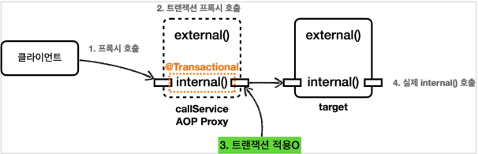
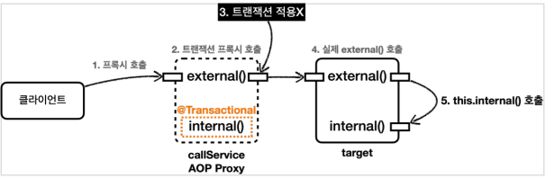
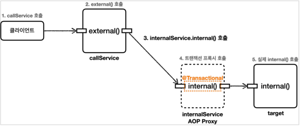

# 스프링 트랜잭션 이해

## 프로젝트 생성

* https://start.spring.io/
* 프로젝트 선택
    * Project: Gradle - Groovy
    * Language: Java 17
    * Spring Boot: 3.0.3
* Project Metadata
    * Group: hello
    * Artifact: spring-db2-2
    * Packaging: Jar
* Dependencies
    * Spring Data JPA, H2 Database, Lombok

#### build.gradle

```gradle
dependencies {
    // ...
    // 테스트에서 Lombok 사용
    testCompileOnly 'org.projectlombok:lombok'
    testAnnotationProcessor 'org.projectlombok:lombok'
}
```

## 트랜잭션 적용 확인

@Transactional 을 통해 선언적 트랜잭션 방식을 사용하면 단순히 애노테이션 하나로 트랜잭션을 적용할 수 있다.
그런데 이 기능은 트랜잭션 관련 코드가 눈에 보이지 않고, AOP를 기반으로 동작하기 때문에, 실제 트랜잭션이 적용되고 있는지 아닌지를 확인하기가 어렵다.

### 확인 방법

#### TxApplyBasicTest

```java
@Slf4j
@SpringBootTest
public class TxApplyBasicTest {

    @Autowired
    BasicService basicService;

    @Test
    void proxyCheck() {
        log.info("aop class = {}", basicService.getClass());
        Assertions.assertThat(AopUtils.isAopProxy(basicService)).isTrue();
    }

    @Test
    void txCheck() {
        basicService.tx();
        basicService.nonTx();
    }

    @TestConfiguration
    static class TxApplyBasicConfig {
        @Bean
        BasicService basicService() {
            return new BasicService();
        }
    }

    @Slf4j
    static class BasicService {
        @Transactional
        public void tx() {
            log.info("call tx");
            boolean txActive = TransactionSynchronizationManager.isActualTransactionActive();
            log.info("tx active = {}", txActive);
        }

        public void nonTx() {
            log.info("call nonTx");
            boolean txActive = TransactionSynchronizationManager.isActualTransactionActive();
            log.info("tx active = {}", txActive);
        }
    }
}
```

#### proxyCheck

```
aop class = class hello.springdb22.apply.TxApplyBasicTest$BasicService$$SpringCGLIB$$0
```

* `AopUtils.isAopProxy()`
* 선언적 트랜잭션 방식에서 스프링 트랜잭션은 AOP를 기반으로 동작한다.
    * `@Transactional` 을 메서드나 클래스에 붙이면 해당 객체는 트랜잭션 AOP 적용의 대상이 되고,
      결과적으로 실제 객체 대신에 트랜잭션을 처리해주는 프록시 객체가 스프링 빈에 등록된다.
    * 그리고 주입을 받을 때도 실제 객체 대신에 프록시 객체가 주입된다.
* 클래스 이름을 출력해보면 `basicService$$EnhancerBySpringCGLIB...` 라고 프록시 클래스의 이름이 출력되는 것을 확인할 수 있다.

### 스프링 컨테이너에 트랜잭션 프록시 등록


* `@Transactional` 애노테이션이 특정 클래스나 메서드에 하나라도 있으면 있으면 트랜잭션 AOP는 프록시를 만들어서 스프링 컨테이너에 등록한다.
    * 그리고 실제 `basicService` 객체 대신에 프록시인 `basicService$$CGLIB`를 스프링 빈에 등록한다.
    * 그리고 프록시는 내부에 실제 `basicService`를 참조하게 된다.
    * 여기서 핵심은 실제 객체 대신에 프록시가 스프링 컨테이너에 등록되었다는 점이다.
* 클라이언트인 `txBasicTest`는 스프링 컨테이너에 `@Autowired BasicService basicService`로 의존관계 주입을 요청한다.
    * 스프링 컨테이너에는 실제 객체 대신에 프록시가 스프링 빈으로 등록되어 있기 때문에 프록시를 주입한다.
    * 프록시는 `BasicService`를 상속해서 만들어지기 때문에 다형성을 활용할 수 있다.
* 따라서 `BasicService` 대신에 프록시인 `BasicService$$CGLIB`를 주입할 수 있다.

#### 동작 방식


### txTest

#### application.properties

```properties
# Transaction
logging.level.org.springframework.transaction.interceptor = trace
```

이 로그를 추가하면 트랜잭션 프록시가 호출하는 트랜잭션의 시작과 종료를 명확하게 로그로 확인할 수 있다.

#### BasicService.tx

* 클라이언트가 `basicService.tx()`를 호출하면, 프록시의 `tx()`가 호출된다.
    * 여기서 프록시는 `tx()` 메서드가 트랜잭션을 사용할 수 있는지 확인해본다.
    * `tx()` 메서드에는 `@Transactional`이 붙어있으므로 트랜잭션 적용 대상이다.
* 따라서 트랜잭션을 시작한 다음에 실제 `basicService.tx()`를 호출한다.
* 그리고 실제 `basicService.tx()`의 호출이 끝나서 프록시로 제어가(리턴) 돌아오면
  프록시는 트랜잭션 로직을 커밋하거나 롤백해서 트랜잭션을 종료한다.

#### BasicService.nonTx

* 클라이언트가 `basicService.nonTx()`를 호출하면, 트랜잭션 프록시의 `nonTx()`가 호출된다.
    * 여기서 `nonTx()` 메서드가 트랜잭션을 사용할 수 있는지 확인해본다.
    * `nonTx()`에는 `@Transactional`이 없으므로 적용 대상이 아니다.
* 따라서 트랜잭션을 시작하지 않고, `basicService.nonTx()`를 호출하고 종료한다.

#### TransactionSynchronizationManager.isActualTransactionActive

* 현재 쓰레드에 트랜잭션이 적용되어 있는지 확인할 수 있는 기능이다.
  결과가 `true`면 트랜잭션이 적용되어 있는 것이다.
  트랜잭션의 적용 여부를 가장 확실하게 확인할 수 있다.

#### 로그

```
# tx() 호출
TransactionInterceptor        : Getting transaction for [hello.springdb22.apply.TxApplyBasicTest$BasicService.tx]
TxApplyBasicTest$BasicService : call tx
TxApplyBasicTest$BasicService : tx active = true
TransactionInterceptor        : Completing transaction for [hello.springdb22.apply.TxApplyBasicTest$BasicService.tx]

# nonTx() 호출
TxApplyBasicTest$BasicService : call nonTx
TxApplyBasicTest$BasicService : tx active = false
```

* 로그를 통해 `tx()` 호출시에는 `tx active=true`를 통해 트랜잭션이 적용된 것을 확인할 수 있다.
* `TransactionInterceptor` 로그를 통해 트랜잭션 프록시가 트랜잭션을 시작하고 완료한 내용을 확인할 수 있다.
* `nonTx()` 호출시에는 `tx active=false`를 통해 트랜잭션이 없는 것을 확인할 수 있다.

## 트랜잭션 적용 위치

스프링에서 우선순위는 항상 더 구체적이고 자세한 것이 높은 우선순위를 가진다.
이것만 기억하면 스프링에서 발생하는 대부분의 우선순위를 쉽게 기억할 수 있다.
그리고 더 구체적인 것이 더 높은 우선순위를 가지는 것은 상식적으로 자연스럽다.

* 클래스 애노테이션 < 메서드 애노테이션
* 부모 클래스 < 자식 클래스

### TxApplyLevelTest

```java
@SpringBootTest
public class TxApplyLevelTest {
    @Autowired
    LevelService service;

    @Test
    void orderTest() {
        service.write();
        service.read();
    }

    @TestConfiguration
    static class TxApplyLevelConfig {
        @Bean
        LevelService levelService() {
            return new LevelService();
        }
    }

    @Slf4j
    @Transactional(readOnly = true)
    static class LevelService {
        @Transactional(readOnly = false)
        public void write() {
            log.info("call write");
            printTxInfo();
        }

        public void read() {
            log.info("call read");
            printTxInfo();
        }

        private void printTxInfo() {
            boolean txActive = TransactionSynchronizationManager.isActualTransactionActive();
            log.info("tx active = {}", txActive);

            boolean readOnly = TransactionSynchronizationManager.isCurrentTransactionReadOnly();
            log.info("tx readOnly = {}", readOnly);
        }
    }
}
```

스프링의 `@Transactional` 은 다음 두 가지 규칙이 있다.

#### 우선순위

트랜잭션을 사용할 때는 다양한 옵션을 사용할 수 있다.
그런데 어떤 경우에는 옵션을 주고, 어떤 경우에는 옵션을 주지 않으면 어떤 것이 선택될까?
예를 들어서 읽기 전용 트랜잭션 옵션을 사용하는 경우와 아닌 경우를 비교해보자.
(읽기 전용 옵션에 대한 자세한 내용은 뒤에서 다룬다. 여기서는 적용 순서에 집중하자.)

* `LevelService`의 타입에 `@Transactional(readOnly = true)`이 붙어있다.
* `write()`
    * 해당 메서드에 `@Transactional(readOnly = false)`이 붙어있다.
    * 이렇게 되면 타입에 있는 `@Transactional(readOnly = true)`와
      해당 메서드에 있는 `@Transactional(readOnly = false)` 둘 중 하나를 적용해야 한다.
    * 클래스 보다는 메서드가 더 구체적이므로 메서드에 있는
      `@Transactional(readOnly = false)` 옵션을 사용한 트랜잭션이 적용된다.

#### 클래스에 적용하면 메서드는 자동 적용

* `read()`
* 해당 메서드에 `@Transactional`이 없다. 이 경우 더 상위인 클래스를 확인한다.
    * 클래스에 `@Transactional(readOnly = true)`이 적용되어 있다.
    * 따라서 트랜잭션이 적용되고 `readOnly = true` 옵션을 사용하게 된다.
* 참고로 `readOnly = false` 는 기본 옵션이기 때문에 보통 생략한다.

#### TransactionSynchronizationManager.isCurrentTransactionReadOnly

현재 트랜잭션에 적용된 `readOnly` 옵션의 값을 반환한다.

#### 실행 결과

```
# write()
TransactionInterceptor     : Getting transaction for [hello.springdb22.apply.TxLevelTest$LevelService.write]
TxLevelTest$LevelService   : call write
TxLevelTest$LevelService   : tx active = true
TxLevelTest$LevelService   : tx readOnly = false
TransactionInterceptor     : Completing transaction for [hello.springdb22.apply.TxLevelTest$LevelService.write]

# read()
TransactionInterceptor     : Getting transaction for [hello.springdb22.apply.TxLevelTest$LevelService.read]
TxLevelTest$LevelService   : call read
TxLevelTest$LevelService   : tx active = true
TxLevelTest$LevelService   : tx readOnly = true
TransactionInterceptor     : Completing transaction for [hello.springdb22.apply.TxLevelTest$LevelService.read]
```

### 인터페이스에 @Transactional 적용

인터페이스에도 `@Transactional`을 적용할 수 있다. 이 경우 다음 순서로 적용된다.
구체적인 것이 더 높은 우선순위를 가진다고 생각하면 바로 이해가 될 것이다.

1. 클래스의 메서드 (우선순위가 가장 높다.)
2. 클래스의 타입
3. 인터페이스의 메서드
4. 인터페이스의 타입 (우선순위가 가장 낮다.)

그런데 인터페이스에 `@Transactional`을 사용하는 것은 스프링 공식 메뉴얼에서 **권장하지 않는 방법**이다.
AOP를 적용하는 방식에 따라서 인터페이스에 애노테이션을 두면 AOP가 적용이 되지 않는 경우도 있기 때문이다.

> 참고<br>
> 스프링은 인터페이스에 `@Transactional`을 사용하는 방식을 스프링 5.0에서 많은 부분 개선했다.
> 과거에는 구체 클래스를 기반으로 프록시를 생성하는 CGLIB 방식을 사용하면 인터페이스에 있는 `@Transactional`을 인식하지 못했다.
> 스프링 5.0 부터는 이 부분을 개선해서 인터페이스에 있는 `@Transactional`도 인식한다.
> 하지만 다른 AOP 방식에서 또 적용되지 않을 수 있으므로 공식 메뉴얼의 가이드대로 가급적 구체 클래스에 `@Transactional`을 사용하자.

## 트랜잭션 AOP 주의 사항 - 프로시 내부 호출 1

### 주의 사항

* `@Transactional`을 사용하면 스프링의 트랜잭션 AOP가 적용된다.
* 트랜잭션 AOP는 기본적으로 프록시 방식의 AOP를 사용한다.

앞서 배운 것 처럼 @Transactional 을 적용하면 프록시 객체가 요청을 먼저 받아서 트랜잭션을 처리하고, 실제 객체를 호출해준다.
따라서 트랜잭션을 적용하려면 항상 **프록시를 통해서 대상 객체(Target)을 호출**해야 한다.
이렇게 해야 프록시에서 먼저 트랜잭션을 적용하고, 이후에 대상 객체를 호출하게 된다.
만약 프록시를 거치지 않고 대상 객체를 직접 호출하게 되면 AOP가 적용되지 않고, 트랜잭션도 적용되지 않는다.



AOP를 적용하면 스프링은 대상 객체 대신에 프록시를 스프링 빈으로 등록한다.
따라서 스프링은 의존관계 주입시에 항상 실제 객체 대신에 프록시 객체를 주입한다.
프록시 객체가 주입되기 때문에 대상 객체를 직접 호출하는 문제는 일반적으로 발생하지 않는다.

하지만 대상 객체의 내부에서 메서드 호출이 발생하면 프록시를 거치지 않고 대상 객체를 직접 호출하는 문제가 발생한다.
이렇게 되면 `@Transactional`이 있어도 트랜잭션이 적용되지 않는다.

### 예제

#### CallService

```java
@Slf4j
static class CallService {
    public void external() {
        log.info("call external");
        printTxInfo();
        internal();
    }

    @Transactional
    public void internal() {
        log.info("call internal");
        printTxInfo();
    }

    private void printTxInfo() {
        boolean txActive = TransactionSynchronizationManager.isActualTransactionActive();
        log.info("tx active = {}", txActive);
    }
}
```

* `external()`은 트랜잭션이 없다.
* `internal()`은 `@Transactional`을 통해 트랜잭션을 적용한다.

#### printProxy

```java
@Test
void printProxy() {
    log.info("call Service class = {}", callService.getClass());
}
```

```
call Service class = class hello.springdb22.apply.InternalCallV1Test$CallService$$SpringCGLIB$$0
```

* `@Transactional`이 하나라도 있으면 트랜잭션 프록시 객체가 만들어진다.
    * 그리고 `callService` 빈을 주입 받으면 트랜잭션 프록시 객체가 대신 주입된다.

#### internalCall

```java
@Test
void internalCall() {
    callService.internal();
}
```


1. 클라이언트인 테스트 코드는 `callService.internal()`을 호출한다.
2. 여기서 `callService`는 트랜잭션 프록시이다.
3. `callService`의 트랜잭션 프록시가 호출된다.
4. `internal()`메서드에 `@Transactional`이 붙어 있으므로 트랜잭션 프록시는 트랜잭션을 적용한다.

* 트랜잭션 적용 후 실제 `callService` 객체 인스턴스의 `internal()`을 호출한다.
    * 실제 `callService`가 처리를 완료하면 응답이 트랜잭션 프록시로 돌아오고, 트랜잭션 프록시는 트랜잭션을 완료한다.

```
Getting transaction for [hello.springdb22.apply.InternalCallV1Test$CallService.internal]
call internal
tx active = true
Completing transaction for [hello.springdb22.apply.InternalCallV1Test$CallService.internal]
```

* `TransactionInterceptor`가 남긴 로그를 통해 트랜잭션 프록시가 트랜잭션을 적용한 것을 확인할 수 있다.
* `CallService`가 남긴 `tx active=true` 로그를 통해 트랜잭션이 적용되어 있음을 확인할 수 있다.

#### externalCall

```java
@Test
void externalCall() {
    callService.external();
}
```

* `external()`은 `@Transactional` 애노테이션이 없다. 따라서 트랜잭션 없이 시작한다.
* 그런데 내부에서 `@Transactional`이 있는 `internal()`을 호출하는 것을 확인할 수 있다.
* 이 경우 `external()`은 트랜잭션이 없지만, `internal()`에서는 트랜잭션이 적용되는 것 처럼 보인다.

```
call external
tx active = false
call internal
tx active = false
```

* 실행 로그를 보면 트랜잭션 관련 코드가 전혀 보이지 않는다.
* 프록시가 아닌 실제 `callService`에서 남긴 로그만 확인된다.
* 추가로 `internal()` 내부에서 호출한 `tx active=false` 로그를 통해 확실히 트랜잭션이 수행되지 않은 것을 확인할 수 있다.

### 프록시와 내부 호출



1. 클라이언트인 테스트 코드는 callService.external() 을 호출한다.
    * 여기서 callService 는 트랜잭션 프록시이다.
2. callService 의 트랜잭션 프록시가 호출된다.
3. external() 메서드에는 @Transactional 이 없다.
    * 따라서 트랜잭션 프록시는 트랜잭션을 적용하지 않는다.
4. 트랜잭션 적용하지 않고, 실제 callService 객체 인스턴스의 external() 을 호출한다.
5. external() 은 내부에서 internal() 메서드를 호출한다. 그런데 여기서 문제가 발생한다.

#### 문제 원인

자바 언어에서 메서드 앞에 별도의 참조가 없으면 `this`라는 뜻으로 자기 자신의 인스턴스를 가리킨다.

결과적으로 자기 자신의 내부 메서드를 호출하는 `this.internal()` 이 되는데,
여기서 `this`는 자기 자신을 가리키므로, 실제 대상 객체(`target`)의 인스턴스를 뜻한다.

결과적으로 이러한 내부 호출은 프록시를 거치지 않는다. 따라서 트랜잭션을 적용할 수 없다.

결과적으로 target 에 있는 `internal()`을 직접 호출하게 된 것이다.

#### 프록시 방식의 AOP 한계

`@Transactional`를 사용하는 트랜잭션 AOP는 프록시를 사용한다.
**프록시를 사용하면 메서드 내부 호출에 프록시를 적용할 수 없다.**

그렇다면 이 문제를 어떻게 해결할 수 있을까?
가장 단순한 방법은 내부 호출을 피하기 위해 `internal()` 메서드를 별도의 클래스로 분리하는 것이다.

## 트랜잭션 AOP 주의 사항 - 프로시 내부 호출 2

### 예제

#### Service Interface

```java
interface Service {
    default void printTxInfo() {
        boolean txActive = TransactionSynchronizationManager.isActualTransactionActive();
        log.info("tx active = {}", txActive);
    }
}
```

* 단순하게 `printTxInfo()`를 공유하기 위해 인터페이스로 분리했다.

#### InternalService

```java
@Slf4j
static class InternalService implements Service {
    @Transactional
    public void internal() {
        log.info("call internal");
        printTxInfo();
    }
}
```

* `InternalService` 클래스를 만들고 `internal()` 메서드를 여기로 옮겼다.
* `InternalService`에는 트랜잭션 관련 코드가 있으므로 트랜잭션 프록시가 적용된다.

#### CallService

```java
@Slf4j
@RequiredArgsConstructor
static class CallService implements Service {
    private final InternalService internalService;

    public void external() {
        log.info("call external");
        printTxInfo();
        internalService.internal();
    }
}
```

* `CallService`에는 트랜잭션 관련 코드가 전혀 없으므로 트랜잭션 프록시가 적용되지 않는다.

#### externalCall

```java
@Slf4j
@SpringBootTest
public class InternalCallV2Test {
    @Autowired
    CallService callService;

    @Test
    void externalCall() {
        callService.external();
    }

    @TestConfiguration
    static class InternalCallV1Config {
        @Bean
        CallService callService() {
            return new CallService(internalService());
        }

        @Bean
        InternalService internalService() {
            return new InternalService();
        }
    }
}
```



1. 클라이언트인 테스트 코드는 `callService.external()`을 호출한다.
2. `callService`는 실제 `callService` 객체 인스턴스이다.
3. `callService`는 주입 받은 `internalService.internal()`을 호출한다.
4. `internalService`는 트랜잭션 프록시이다.
    * `internal()` 메서드에 @`Transactional`이 붙어 있으므로 트랜잭션 프록시는 트랜잭션을 적용한다.
5. 트랜잭션 적용 후 실제 `internalService` 객체 인스턴스의 `internal()`을 호출한다.

#### 결과 로그

```
call external
tx active = false

Getting transaction for [hello.springdb22.apply.InternalCallV2Test$InternalService.internal]
call internal
tx active = true
Completing transaction for [hello.springdb22.apply.InternalCallV2Test$InternalService.internal]
```

### public 메서드만 트랜잭션 적용

스프링의 트랜잭션 AOP 기능은 public 메서드에만 트랜잭션을 적용하도록 기본 설정이 되어있다.
그래서 `protected`, `private`, `package-visible`에는 트랜잭션이 적용되지 않는다.

생각해보면 `protected`, `package-visible`도 외부에서 호출이 가능하다.
따라서 이 부분은 앞서 설명한 프록시의 내부 호출과는 무관하고, 스프링이 막아둔 것이다.

이렇게 클래스 레벨에 트랜잭션을 적용하면 모든 메서드에 트랜잭션이 걸릴 수 있다.
그러면 트랜잭션을 의도하지 않는 곳 까지 트랜잭션이 과도하게 적용된다.
트랜잭션은 주로 비즈니스 로직의 시작점에 걸기 때문에 대부분 외부에 열어준 곳을 시작점으로 사용한다.
이런 이유로 `public` 메서드에만 트랜잭션을 적용하도록 설정되어 있다.
앞서 실행했던 코드를 `package-visible` 로 변경해보면 적용되지 않는 것을 확인할 수 있다.

참고로 `public`이 아닌곳에 `@Transactional`이 붙어 있으면 예외가 발생하지는 않고, 트랜잭션 적용만 **무시**된다.

## 트랜잭션 AOP 주의 사항 - 초기화 시점

스프링 초기화 시점에는 트랜잭션 AOP가 적용되지 않을 수 있다.

### 예제

#### initTxTest

```java
@SpringBootTest
public class InitTxTest {

    @Autowired
    Hello hello;

    @Test
    void go() {
        // 초기화 코드는 스프링이 초기화되는 시점에 호출한다.
    }

    @TestConfiguration
    static class InitTxTestConfig {
        @Bean
        Hello hello() {
            return new Hello();
        }
    }

    @Slf4j
    static class Hello {
        @PostConstruct
        @Transactional
        public void initV1() {
            boolean isActive = TransactionSynchronizationManager.isActualTransactionActive();
            log.info("Hello init v1 @PostConstruct tx active = {}", isActive);
        }

        @EventListener(value = ApplicationReadyEvent.class)
        @Transactional
        public void initV2() {
            boolean isActive = TransactionSynchronizationManager.isActualTransactionActive();
            log.info("Hello init v2 @PostConstruct tx active = {}", isActive);
        }
    }
}
```

#### 결과 로그

```
# init V1
h.springdb22.apply.InitTxTest$Hello      : Hello init v1 @PostConstruct tx active = false

# Test Start
hello.springdb22.apply.InitTxTest        : Started InitTxTest in 1.088 seconds (process running for 1.808)

# init V2
o.s.t.i.TransactionInterceptor           : Getting transaction for [hello.springdb22.apply.InitTxTest$Hello.initV2]
h.springdb22.apply.InitTxTest$Hello      : Hello init v2 @PostConstruct tx active = true
o.s.t.i.TransactionInterceptor           : Completing transaction for [hello.springdb22.apply.InitTxTest$Hello.initV2]
```

* 초기화 코드(예: `@PostConstruct`)와 `@Transactional`을 함께 사용하면 트랜잭션이 적용되지 않는다.
* 왜냐하면 **초기화 코드가 먼저 호출되고, 그 다음에 트랜잭션 AOP가 적용되기 때문**이다.
    * 따라서 초기화 시점에는 해당 메서드에서 트랜잭션을 획득할 수 없다.

* 가장 확실한 대안은 `ApplicationReadyEvent` 이벤트를 사용하는 것이다.
* 이 이벤트는 트랜잭션 AOP를 포함한 스프링이 컨테이너가 완전히 생성되고 난 다음에 이벤트가 붙은 메서드를 호출해준다.
    * 따라서 `init2()`는 트랜잭션이 적용된 것을 확인할 수 있다.

## 트랜잭션 옵션 소개

### @Transactional

```java
public @interface Transactional {
    String value() default "";
    String transactionManager() default "";
    
    Class<? extends Throwable>[] rollbackFor() default {};
    Class<? extends Throwable>[] noRollbackFor() default {};
    
    Propagation propagation() default Propagation.REQUIRED;
    Isolation isolation() default Isolation.DEFAULT;
    int timeout() default TransactionDefinition.TIMEOUT_DEFAULT;
    
    boolean readOnly() default false;
    String[] label() default {};
}
```

#### value, transactionManager

* 트랜잭션 매니저 선택
* 트랜잭션 매니저가 하나만 있다면 생략할 수 있다.
* 두 개 이상이라면 지정해주어야 한다.

#### rollbackFor

* 기본 정책에 추가로 어떤 예외가 발생할 때 롤백할 지 지정
* rollbackForClassName
    * 예외 이름을 문자열로 지정

#### noRollbackFor

* rollbackFor 의 반대
* rollbackForClassName

#### propagation

* 트랜잭션 전파 옵션

#### isolation

* 트랜잭션 격리 수준
    * READ_UNCOMMITTED
    * READ_COMMITTED
    * REPEATABLE_READ
    * SERIALIZABLE
* 기본값: 트랜잭션 시스템의 기본 격리 수준 사용

#### timeout

* 트랜잭션 수행 타임 아웃 지정, 초 단위이다.
* 기본값: 트랜잭션 시스템의 타임아웃 값 사용
* timeoutString

#### label

* 트랜잭션 애노테이션에 있는 값을 직접 읽어서 어떤 동작을 할지 결정

#### readOnly

* 해당 트랜잭션을 읽기 전용으로 지정
* 기본값: false

* **프레임워크**
    * JdbcTemplate은 읽기 전용 트랜잭션 안에서 변경 기능을 실행하면 예외를 던진다.
    * JPA(하이버네이트)는 읽기 전용 트랜잭션의 경우 커밋 시점에 플러시를 호출하지 않는다.
    * 읽기 전용이니 변경에 사용되는 플러시를 호출할 필요가 없다.
    * 추가로 변경이 필요 없으니 변경 감지를 위한 스냅샷 객체도 생성하지 않는다.
    * 이렇게 JPA에서는 다양한 최적화가 발생한다.
        * JPA 관련 내용은 JPA를 더 학습해야 이해할 수 있으므로 지금은 이런 것이 있다 정도만 알아두자.
* **JDBC 드라이버**
    * 참고로 여기서 설명하는 내용들은 DB와 드라이버 버전에 따라서 다르게 동작하기 때문에 사전에 확인이 필요하다.
    * 읽기 전용 트랜잭션에서 변경 쿼리가 발생하면 예외를 던진다.
    * 읽기, 쓰기 (마스터, 슬레이브) 데이터베이스를 구분해서 요청한다.
    * 읽기 전용 트랜잭션의 경우 읽기 (슬레이브) 데이터베이스의 커넥션을 획득해서 사용한다.
        * 예) https://dev.mysql.com/doc/connector-j/8.0/en/connector-j-source-replicareplication-connection.html
* **데이터베이스**
    * 데이터베이스에 따라 읽기 전용 트랜잭션의 경우 읽기만 하면 되므로, 내부에서 성능 최적화가 발생한다.

## 예외와 트랜잭션 커밋, 롤백 - 기본

### 예제

#### application.properties

```properties
# Transaction
logging.level.org.springframework.transaction.interceptor = trace

# JPA log
logging.level.org.hibernate.resource.transaction = debug
logging.level.org.springframework.orm.jpa.JpaTransactionManager = debug
logging.level.org.springframework.jdbc.datasource.DataSourceTransactionManager = debug
```

#### runtimeException

```java
@Transactional
public void runtimeException() {
    log.info("call runtimeException");
    throw new RuntimeException();
}
```

```
o.s.orm.jpa.JpaTransactionManager        : Creating new transaction with name [hello.springdb22.apply.RollbackTest$RollbackService.runtimeException]: PROPAGATION_REQUIRED,ISOLATION_DEFAULT
o.s.orm.jpa.JpaTransactionManager        : Opened new EntityManager [SessionImpl(342191077<open>)] for JPA transaction
o.s.orm.jpa.JpaTransactionManager        : Exposing JPA transaction as JDBC [org.springframework.orm.jpa.vendor.HibernateJpaDialect$HibernateConnectionHandle@20be890d]
o.s.t.i.TransactionInterceptor           : Getting transaction for [hello.springdb22.apply.RollbackTest$RollbackService.runtimeException]
h.s.apply.RollbackTest$RollbackService   : call runtimeException
o.s.t.i.TransactionInterceptor           : Completing transaction for [hello.springdb22.apply.RollbackTest$RollbackService.runtimeException] after exception: java.lang.RuntimeException
o.s.orm.jpa.JpaTransactionManager        : Initiating transaction rollback
o.s.orm.jpa.JpaTransactionManager        : Rolling back JPA transaction on EntityManager [SessionImpl(342191077<open>)]
o.s.orm.jpa.JpaTransactionManager        : Closing JPA EntityManager [SessionImpl(342191077<open>)] after transaction
```

* `RuntimeException`이 발생하므로 트랜잭션이 롤백된다.

#### checkedException

```java
@Transactional
public void checkedException() throws MyException {
    log.info("call checkedException");
    throw new MyException();
}
```

```
o.s.orm.jpa.JpaTransactionManager        : Creating new transaction with name [hello.springdb22.apply.RollbackTest$RollbackService.checkedException]: PROPAGATION_REQUIRED,ISOLATION_DEFAULT
o.s.orm.jpa.JpaTransactionManager        : Opened new EntityManager [SessionImpl(2019087133<open>)] for JPA transaction
o.s.orm.jpa.JpaTransactionManager        : Exposing JPA transaction as JDBC [org.springframework.orm.jpa.vendor.HibernateJpaDialect$HibernateConnectionHandle@782e6b40]
o.s.t.i.TransactionInterceptor           : Getting transaction for [hello.springdb22.apply.RollbackTest$RollbackService.checkedException]
h.s.apply.RollbackTest$RollbackService   : call checkedException
o.s.t.i.TransactionInterceptor           : Completing transaction for [hello.springdb22.apply.RollbackTest$RollbackService.checkedException] after exception: hello.springdb22.apply.RollbackTest$MyException
o.s.orm.jpa.JpaTransactionManager        : Initiating transaction commit
o.s.orm.jpa.JpaTransactionManager        : Committing JPA transaction on EntityManager [SessionImpl(2019087133<open>)]
o.s.orm.jpa.JpaTransactionManager        : Closing JPA EntityManager [SessionImpl(2019087133<open>)] after transaction
```

* `MyException`은 `Exception`을 상속받은 체크 예외이다. 따라서 예외가 발생해도 트랜잭션이 커밋된다.

#### rollbackFor

```java
@Transactional(rollbackFor = MyException.class)
public void rollbackFor() throws MyException {
    log.info("call rollbackFor");
    throw new MyException();
}
```

```
o.s.orm.jpa.JpaTransactionManager        : Creating new transaction with name [hello.springdb22.apply.RollbackTest$RollbackService.rollbackFor]: PROPAGATION_REQUIRED,ISOLATION_DEFAULT,-hello.springdb22.apply.RollbackTest$MyException
o.s.orm.jpa.JpaTransactionManager        : Opened new EntityManager [SessionImpl(1711445717<open>)] for JPA transaction
o.s.orm.jpa.JpaTransactionManager        : Exposing JPA transaction as JDBC [org.springframework.orm.jpa.vendor.HibernateJpaDialect$HibernateConnectionHandle@1d7f2f0a]
o.s.t.i.TransactionInterceptor           : Getting transaction for [hello.springdb22.apply.RollbackTest$RollbackService.rollbackFor]
h.s.apply.RollbackTest$RollbackService   : call rollbackFor
o.s.t.i.TransactionInterceptor           : Completing transaction for [hello.springdb22.apply.RollbackTest$RollbackService.rollbackFor] after exception: hello.springdb22.apply.RollbackTest$MyException
o.s.orm.jpa.JpaTransactionManager        : Initiating transaction rollback
o.s.orm.jpa.JpaTransactionManager        : Rolling back JPA transaction on EntityManager [SessionImpl(1711445717<open>)]
o.s.orm.jpa.JpaTransactionManager        : Closing JPA EntityManager [SessionImpl(1711445717<open>)] after transaction
```

* 기본 정책과 무관하게 특정 예외를 강제로 롤백하고 싶으면 `rollbackFor`를 사용하면 된다. (해당 예외의 자식도 포함된다.)
* `rollbackFor = MyException.class`을 지정했기 때문에 `MyException`이 발생하면 체크 예외이지만 트랜잭션이 롤백된다.

## 예외와 트랜잭션 커밋, 롤백 - 활용

### 스프링의 기본 정책

> 스프링은 기본적으로
> * 체크 예외는 비즈니스 의미가 있을 때 사용하고,
> * 런타임(언체크) 예외는 복구 불가능한 예외로 가정한다.

참고로 꼭 이런 정책을 따를 필요는 없다. 그때는 앞서 배운 rollbackFor 라는 옵션을 사용해서 체크 예외도 롤백하면 된다.

#### 비즈니스 예외?

주문을 하는데 상황에 따라 다음과 같이 조치한다.

* 정상
    * 주문시 결제를 성공하면 주문 데이터를 저장하고 결제 상태를 완료로 처리한다.
* 시스템 예외
    * 주문시 내부에 복구 불가능한 예외가 발생하면 전체 데이터를 롤백한다.
* 비즈니스 예외
    * 주문시 결제 잔고가 부족하면 주문 데이터를 저장하고, 결제 상태를 대기로 처리한다.
    * 이 경우 **고객에게 잔고 부족을 알리고 별도의 계좌로 입금하도록 안내**한다.

이때 결제 잔고가 부족하면 `NotEnoughMoneyException`이라는 체크 예외가 발생한다고 가정하겠다.

이 예외는 시스템에 문제가 있어서 발생하는 시스템 예외가 아니다.
시스템은 정상 동작했지만, 비즈니스 상황에서 문제가 되기 때문에 발생한 예외이다.
더 자세히 설명하자면, 고객의 잔고가 부족한 것은 시스템에 문제가 있는 것이 아니다.
오히려 시스템은 문제 없이 동작한 것이고, 비즈니스 상황이 예외인 것이다.

이런 예외를 비즈니스 예외라 한다.
그리고 비즈니스 예외는 매우 중요하고, 반드시 처리해야 하는 경우가 많으므로 체크 예외를 고려할 수 있다.

### 예제

#### application.properties

```properties
# JPA
spring.jpa.hibernate.ddl-auto = create

# Transaction Log
logging.level.org.springframework.transaction.interceptor = trace
logging.level.org.springframework.orm.jpa.JpaTransactionManager = debug
logging.level.org.springframework.jdbc.datasource.DataSourceTransactionManager = debug

# Hibernate log
logging.level.org.hibernate.SQL = debug
logging.level.org.hibernate.orm.jdbc.bind = trace
logging.level.org.hibernate.resource.transaction = debug
```

* spring.jpa.hibernate.ddl-auto
    * JPA가 Entity의 정보를 기반으로 생성할지 결정
    * 기본값: none
    * 운영환경에서는 사용하면 안된다.
* logging.level.org.hibernate.SQL
    * 실제로 어떤 SQL 문이 나가는지 확인
* logging.level.org.hibernate.orm.jdbc.bind
    * SQL 문에 바인딩된 파라미터를 확인
* logging.level.org.springframework.orm.jpa.JpaTransactionManager
    * 현재 트랜잭션 매저가 어떤 행동을 했는지 확인

#### NotEnoughMoneyException

```java
/**
 * 고객의 잔고가 부족하면 발생
 */
public class NotEnoughMoneyException extends Exception {
    public NotEnoughMoneyException(String message) {
        super(message);
    }
}
```

* 결제 잔고가 부족하면 발생하는 비즈니스 예외이다.
* `Exception`을 상속 받아서 체크 예외가 된다.

#### Order

```java
@Entity
@Table(name = "orders")
@Getter
public class Order {
    @Id
    @GeneratedValue
    private Long id;

    private String username;
    private String payStatus;

    public void setUsername(String username) {
        this.username = username;
    }

    public void setPayStatus(String payStatus) {
        this.payStatus = payStatus;
    }
}
```

* JPA를 사용하는 `Order` 엔티티이다.
* 예제를 단순하게 하기 위해 `@Getter`, `@Setter`를 사용했다.
    * 참고로 실무에서 엔티티에 `@Setter`를 남발해서 불필요한 변경 포인트를 노출하는 것은 좋지 않다.
* **주의!**
    * `@Table(name = "orders")`라고 했는데, 테이블 이름을 지정하지 않으면 테이블 이름이 클래스 이름인 `order`가 된다.
    * `order`는 데이터베이스 예약어(`order by`)여서 사용할 수 없다.
    * 그래서 `orders`라는 테이블 이름을 따로 지정해주었다.

#### OrderRepository

```java
public interface OrderRepository extends JpaRepository<Order, Long> { }
```

* 스프링 데이터 JPA를 사용한다.

#### OrderService

```java
@Slf4j
@Service
@RequiredArgsConstructor
public class OrderService {
    private final OrderRepository orderRepository;

    @Transactional
    public void order(Order order) throws NotEnoughMoneyException {
        log.info("OrderService.order 호출");
        orderRepository.save(order);

        log.info("결제 프로세스 진입");

        if (order.getUsername().equals("예외")) {
            log.info("시스템 예외 발생");
            throw new RuntimeException("시스템 예외");
        } else if (order.getUsername().equals("잔고부족")) {
            log.info("잔고 부족 비즈니스 예외 발생");
            order.setPayStatus("대기");
            throw new NotEnoughMoneyException("잔고가 부족합니다");
        } else {
            log.info("정상 승인");
            order.setPayStatus("완료");
        }

        log.info("결제 프로세스 완료");
    }
}
```

여러 상황을 만들기 위해서 사용자 이름( username )에 따라서 처리 프로세스를 다르게 했다.

* 기본
    * `payStatus`를 완료 상태로 처리하고 정상 처리된다.
* 예외
    * `RuntimeException("시스템 예외")` 런타임 예외가 발생한다.
* 잔고부족
    * `payStatus`를 대기 상태로 처리한다.
    * `NotEnoughMoneyException("잔고가 부족합니다")` 체크 예외가 발생한다.
    * 잔고 부족은 `payStatus`를 대기 상태로 두고, 체크 예외가 발생하지만, `order` 데이터는 커밋되기를 기대한다.

### OrderServiceTest

#### complete

```java
@Test
void complete() throws NotEnoughMoneyException {
    Order order = new Order();
    order.setUsername("정상");

    orderService.order(order);

    Order findOrder = orderRepository.findById(order.getId()).get();
    assertThat(findOrder.getPayStatus()).isEqualTo("완료");
}
```

```
# 트랜잭션 시작
o.s.orm.jpa.JpaTransactionManager        : Creating new transaction with name [hello.springdb22.order.OrderService.order]: PROPAGATION_REQUIRED,ISOLATION_DEFAULT
o.s.orm.jpa.JpaTransactionManager        : Opened new EntityManager [SessionImpl(1534365740<open>)] for JPA transaction
o.s.orm.jpa.JpaTransactionManager        : Exposing JPA transaction as JDBC [org.springframework.orm.jpa.vendor.HibernateJpaDialect$HibernateConnectionHandle@26888c31]
o.s.t.i.TransactionInterceptor           : Getting transaction for [hello.springdb22.order.OrderService.order]

# OrderService 로직 시작
hello.springdb22.order.OrderService      : OrderService.order 호출

# JpaRepository.save 호출을 위해 DB에서 orders_seq 를 SELECT
o.s.orm.jpa.JpaTransactionManager        : Found thread-bound EntityManager [SessionImpl(1534365740<open>)] for JPA transaction
o.s.orm.jpa.JpaTransactionManager        : Participating in existing transaction
o.s.t.i.TransactionInterceptor           : Getting transaction for [org.springframework.data.jpa.repository.support.SimpleJpaRepository.save]
org.hibernate.SQL                        : select next value for orders_seq
o.s.t.i.TransactionInterceptor           : Completing transaction for [org.springframework.data.jpa.repository.support.SimpleJpaRepository.save]

# 로직 진행
hello.springdb22.order.OrderService      : 결제 프로세스 진입
hello.springdb22.order.OrderService      : 정상 승인
hello.springdb22.order.OrderService      : 결제 프로세스 완료

# 함수 호출 종료에 따라 Commit 진행 시작
o.s.t.i.TransactionInterceptor           : Completing transaction for [hello.springdb22.order.OrderService.order]
o.s.orm.jpa.JpaTransactionManager        : Initiating transaction commit
o.s.orm.jpa.JpaTransactionManager        : Committing JPA transaction on EntityManager [SessionImpl(1534365740<open>)]

# 이제 실제로 INSERT 문이 나간다.
org.hibernate.SQL                        : insert into orders (pay_status, username, id) values (?, ?, ?)
org.hibernate.orm.jdbc.bind              : binding parameter [1] as [VARCHAR] - [null]
org.hibernate.orm.jdbc.bind              : binding parameter [2] as [VARCHAR] - [정상]
org.hibernate.orm.jdbc.bind              : binding parameter [3] as [BIGINT] - [1]

# 중간에 Order Entity의 payStatus의 값이 바뀌었으므로 UPDATE 문도 같이 실행된다.
org.hibernate.SQL                        : update orders set pay_status=?, username=? where id=?
org.hibernate.orm.jdbc.bind              : binding parameter [1] as [VARCHAR] - [완료]
org.hibernate.orm.jdbc.bind              : binding parameter [2] as [VARCHAR] - [정상]
org.hibernate.orm.jdbc.bind              : binding parameter [3] as [BIGINT] - [1]

# 위의 변경사항을 모두 적용하였으므로 트랜잭션 매니저를 종료한다.
o.s.orm.jpa.JpaTransactionManager        : Closing JPA EntityManager [SessionImpl(1534365740<open>)] after transaction
```

#### runtimeException

```java
@Test
void runtimeException() {
    Order order = new Order();
    order.setUsername("예외");

    assertThatThrownBy(() -> orderService.order(order))
            .isInstanceOf(RuntimeException.class);

    Optional<Order> orderOptional = orderRepository.findById(order.getId());
    assertThat(orderOptional.isEmpty()).isTrue();
}
```

```
# 트랜잭션 시작
o.s.orm.jpa.JpaTransactionManager        : Creating new transaction with name [hello.springdb22.order.OrderService.order]: PROPAGATION_REQUIRED,ISOLATION_DEFAULT
o.s.orm.jpa.JpaTransactionManager        : Opened new EntityManager [SessionImpl(35126588<open>)] for JPA transaction
o.s.orm.jpa.JpaTransactionManager        : Exposing JPA transaction as JDBC [org.springframework.orm.jpa.vendor.HibernateJpaDialect$HibernateConnectionHandle@69ac5752]
o.s.t.i.TransactionInterceptor           : Getting transaction for [hello.springdb22.order.OrderService.order]

# OrderService 로직 시작
hello.springdb22.order.OrderService      : OrderService.order 호출

# JpaRepository.save 호출
o.s.orm.jpa.JpaTransactionManager        : Found thread-bound EntityManager [SessionImpl(35126588<open>)] for JPA transaction
o.s.orm.jpa.JpaTransactionManager        : Participating in existing transaction
o.s.t.i.TransactionInterceptor           : Getting transaction for [org.springframework.data.jpa.repository.support.SimpleJpaRepository.save]
o.s.t.i.TransactionInterceptor           : Completing transaction for [org.springframework.data.jpa.repository.support.SimpleJpaRepository.save]

# 로직 진행
hello.springdb22.order.OrderService      : 결제 프로세스 진입
hello.springdb22.order.OrderService      : 시스템 예외 발생

# Runtime 예외 발생, Rollback 을 진행한다.
o.s.t.i.TransactionInterceptor           : Completing transaction for [hello.springdb22.order.OrderService.order] after exception: java.lang.RuntimeException: 시스템 예외
o.s.orm.jpa.JpaTransactionManager        : Initiating transaction rollback
o.s.orm.jpa.JpaTransactionManager        : Rolling back JPA transaction on EntityManager [SessionImpl(35126588<open>)]
o.s.orm.jpa.JpaTransactionManager        : Closing JPA EntityManager [SessionImpl(35126588<open>)] after transaction
```

#### bizException

```java
@Test
void bizException() {
    Order order = new Order();
    order.setUsername("잔고부족");

    try {
        orderService.order(order);
        fail("잔고 부족 예외가 발생해야 합니다.");
    } catch (NotEnoughMoneyException e) {
        log.info("고객에게 잔고 부족을 알리고 별도의 계좌로 입금하도록 안내");
    }

    Order findOrder = orderRepository.findById(order.getId()).get();
    assertThat(findOrder.getPayStatus()).isEqualTo("대기");
}
```

```
# 트랜잭션 시작
o.s.orm.jpa.JpaTransactionManager        : Creating new transaction with name [hello.springdb22.order.OrderService.order]: PROPAGATION_REQUIRED,ISOLATION_DEFAULT
o.s.orm.jpa.JpaTransactionManager        : Opened new EntityManager [SessionImpl(1223960142<open>)] for JPA transaction
o.s.orm.jpa.JpaTransactionManager        : Exposing JPA transaction as JDBC [org.springframework.orm.jpa.vendor.HibernateJpaDialect$HibernateConnectionHandle@2697c156]
o.s.t.i.TransactionInterceptor           : Getting transaction for [hello.springdb22.order.OrderService.order]

# OrderService 로직 시작
hello.springdb22.order.OrderService      : OrderService.order 호출

# JpaRepository.save 호출을 위해 DB에서 sequence 를 SELECT
o.s.orm.jpa.JpaTransactionManager        : Found thread-bound EntityManager [SessionImpl(1223960142<open>)] for JPA transaction
o.s.orm.jpa.JpaTransactionManager        : Participating in existing transaction
o.s.t.i.TransactionInterceptor           : Getting transaction for [org.springframework.data.jpa.repository.support.SimpleJpaRepository.save]
org.hibernate.SQL                        : select next value for orders_seq
o.s.t.i.TransactionInterceptor           : Completing transaction for [org.springframework.data.jpa.repository.support.SimpleJpaRepository.save]

# 로직 진행
hello.springdb22.order.OrderService      : 결제 프로세스 진입
hello.springdb22.order.OrderService      : 잔고 부족 비즈니스 예외 발생

# NotEnoughMoneyException 예외 발생
o.s.t.i.TransactionInterceptor           : Completing transaction for [hello.springdb22.order.OrderService.order] after exception: hello.springdb22.order.NotEnoughMoneyException: 잔고가 부족합니다

# Checked Exception 이므로 COMMIT 진행
o.s.orm.jpa.JpaTransactionManager        : Initiating transaction commit
o.s.orm.jpa.JpaTransactionManager        : Committing JPA transaction on EntityManager [SessionImpl(1223960142<open>)]

# 이제 실제로 INSERT 문이 나간다.
org.hibernate.SQL                        : insert into orders (pay_status, username, id) values (?, ?, ?)
org.hibernate.orm.jdbc.bind              : binding parameter [1] as [VARCHAR] - [null]
org.hibernate.orm.jdbc.bind              : binding parameter [2] as [VARCHAR] - [잔고부족]
org.hibernate.orm.jdbc.bind              : binding parameter [3] as [BIGINT] - [2]

# 중간에 Order Entity의 payStatus의 값이 바뀌었으므로 UPDATE 문도 같이 실행된다.
org.hibernate.SQL                        : update orders set pay_status=?, username=? where id=?
org.hibernate.orm.jdbc.bind              : binding parameter [1] as [VARCHAR] - [대기]
org.hibernate.orm.jdbc.bind              : binding parameter [2] as [VARCHAR] - [잔고부족]
org.hibernate.orm.jdbc.bind              : binding parameter [3] as [BIGINT] - [2]

# 위의 변경사항을 모두 적용하였으므로 트랜잭션 매니저를 종료한다.
o.s.orm.jpa.JpaTransactionManager        : Closing JPA EntityManager [SessionImpl(1223960142<open>)] after transaction
```