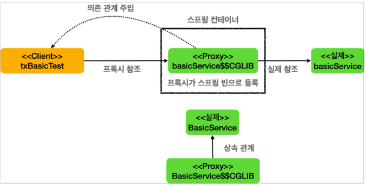

# 스프링 트랜잭션 이해

## 프로젝트 생성

* https://start.spring.io/
* 프로젝트 선택
    * Project: Gradle - Groovy
    * Language: Java 17
    * Spring Boot: 3.0.3
* Project Metadata
    * Group: hello
    * Artifact: spring-db2-2
    * Packaging: Jar
* Dependencies
    * Spring Data JPA, H2 Database, Lombok

#### build.gradle

```gradle
dependencies {
    // ...
    // 테스트에서 Lombok 사용
    testCompileOnly 'org.projectlombok:lombok'
    testAnnotationProcessor 'org.projectlombok:lombok'
}
```

## 트랜잭션 적용 확인

@Transactional 을 통해 선언적 트랜잭션 방식을 사용하면 단순히 애노테이션 하나로 트랜잭션을 적용할 수 있다.
그런데 이 기능은 트랜잭션 관련 코드가 눈에 보이지 않고, AOP를 기반으로 동작하기 때문에, 실제 트랜잭션이 적용되고 있는지 아닌지를 확인하기가 어렵다.

### 확인 방법

#### TxApplyBasicTest

```java
@Slf4j
@SpringBootTest
public class TxApplyBasicTest {

    @Autowired
    BasicService basicService;

    @Test
    void proxyCheck() {
        log.info("aop class = {}", basicService.getClass());
        Assertions.assertThat(AopUtils.isAopProxy(basicService)).isTrue();
    }

    @Test
    void txCheck() {
        basicService.tx();
        basicService.nonTx();
    }

    @TestConfiguration
    static class TxApplyBasicConfig {
        @Bean
        BasicService basicService() {
            return new BasicService();
        }
    }

    @Slf4j
    static class BasicService {
        @Transactional
        public void tx() {
            log.info("call tx");
            boolean txActive = TransactionSynchronizationManager.isActualTransactionActive();
            log.info("tx active = {}", txActive);
        }

        public void nonTx() {
            log.info("call nonTx");
            boolean txActive = TransactionSynchronizationManager.isActualTransactionActive();
            log.info("tx active = {}", txActive);
        }
    }
}
```

#### proxyCheck

```
aop class = class hello.springdb22.apply.TxApplyBasicTest$BasicService$$SpringCGLIB$$0
```

* `AopUtils.isAopProxy()`
* 선언적 트랜잭션 방식에서 스프링 트랜잭션은 AOP를 기반으로 동작한다.
    * `@Transactional` 을 메서드나 클래스에 붙이면 해당 객체는 트랜잭션 AOP 적용의 대상이 되고,
      결과적으로 실제 객체 대신에 트랜잭션을 처리해주는 프록시 객체가 스프링 빈에 등록된다.
    * 그리고 주입을 받을 때도 실제 객체 대신에 프록시 객체가 주입된다.
* 클래스 이름을 출력해보면 `basicService$$EnhancerBySpringCGLIB...` 라고 프록시 클래스의 이름이 출력되는 것을 확인할 수 있다.

### 스프링 컨테이너에 트랜잭션 프록시 등록



* `@Transactional` 애노테이션이 특정 클래스나 메서드에 하나라도 있으면 있으면 트랜잭션 AOP는 프록시를 만들어서 스프링 컨테이너에 등록한다.
    * 그리고 실제 `basicService` 객체 대신에 프록시인 `basicService$$CGLIB`를 스프링 빈에 등록한다.
    * 그리고 프록시는 내부에 실제 `basicService`를 참조하게 된다.
    * 여기서 핵심은 실제 객체 대신에 프록시가 스프링 컨테이너에 등록되었다는 점이다.
* 클라이언트인 `txBasicTest`는 스프링 컨테이너에 `@Autowired BasicService basicService`로 의존관계 주입을 요청한다.
    * 스프링 컨테이너에는 실제 객체 대신에 프록시가 스프링 빈으로 등록되어 있기 때문에 프록시를 주입한다.
    * 프록시는 `BasicService`를 상속해서 만들어지기 때문에 다형성을 활용할 수 있다.
* 따라서 `BasicService` 대신에 프록시인 `BasicService$$CGLIB`를 주입할 수 있다.

#### 동작 방식


### txTest

#### application.properties

```properties
# Transaction
logging.level.org.springframework.transaction.interceptor = trace
```

이 로그를 추가하면 트랜잭션 프록시가 호출하는 트랜잭션의 시작과 종료를 명확하게 로그로 확인할 수 있다.

#### BasicService.tx

* 클라이언트가 `basicService.tx()`를 호출하면, 프록시의 `tx()`가 호출된다.
    * 여기서 프록시는 `tx()` 메서드가 트랜잭션을 사용할 수 있는지 확인해본다.
    * `tx()` 메서드에는 `@Transactional`이 붙어있으므로 트랜잭션 적용 대상이다.
* 따라서 트랜잭션을 시작한 다음에 실제 `basicService.tx()`를 호출한다.
* 그리고 실제 `basicService.tx()`의 호출이 끝나서 프록시로 제어가(리턴) 돌아오면
  프록시는 트랜잭션 로직을 커밋하거나 롤백해서 트랜잭션을 종료한다.

#### BasicService.nonTx

* 클라이언트가 `basicService.nonTx()`를 호출하면, 트랜잭션 프록시의 `nonTx()`가 호출된다.
    * 여기서 `nonTx()` 메서드가 트랜잭션을 사용할 수 있는지 확인해본다.
    * `nonTx()`에는 `@Transactional`이 없으므로 적용 대상이 아니다.
* 따라서 트랜잭션을 시작하지 않고, `basicService.nonTx()`를 호출하고 종료한다.

#### TransactionSynchronizationManager.isActualTransactionActive

* 현재 쓰레드에 트랜잭션이 적용되어 있는지 확인할 수 있는 기능이다.
  결과가 `true`면 트랜잭션이 적용되어 있는 것이다.
  트랜잭션의 적용 여부를 가장 확실하게 확인할 수 있다.

#### 로그

```
# tx() 호출
TransactionInterceptor        : Getting transaction for [hello.springdb22.apply.TxApplyBasicTest$BasicService.tx]
TxApplyBasicTest$BasicService : call tx
TxApplyBasicTest$BasicService : tx active = true
TransactionInterceptor        : Completing transaction for [hello.springdb22.apply.TxApplyBasicTest$BasicService.tx]

# nonTx() 호출
TxApplyBasicTest$BasicService : call nonTx
TxApplyBasicTest$BasicService : tx active = false
```

* 로그를 통해 `tx()` 호출시에는 `tx active=true`를 통해 트랜잭션이 적용된 것을 확인할 수 있다.
* `TransactionInterceptor` 로그를 통해 트랜잭션 프록시가 트랜잭션을 시작하고 완료한 내용을 확인할 수 있다.
* `nonTx()` 호출시에는 `tx active=false`를 통해 트랜잭션이 없는 것을 확인할 수 있다.

## 트랜잭션 적용 위치

스프링에서 우선순위는 항상 더 구체적이고 자세한 것이 높은 우선순위를 가진다.
이것만 기억하면 스프링에서 발생하는 대부분의 우선순위를 쉽게 기억할 수 있다.
그리고 더 구체적인 것이 더 높은 우선순위를 가지는 것은 상식적으로 자연스럽다.

* 클래스 애노테이션 < 메서드 애노테이션
* 부모 클래스 < 자식 클래스

### TxApplyLevelTest

```java
@SpringBootTest
public class TxApplyLevelTest {
    @Autowired
    LevelService service;

    @Test
    void orderTest() {
        service.write();
        service.read();
    }

    @TestConfiguration
    static class TxApplyLevelConfig {
        @Bean
        LevelService levelService() {
            return new LevelService();
        }
    }

    @Slf4j
    @Transactional(readOnly = true)
    static class LevelService {
        @Transactional(readOnly = false)
        public void write() {
            log.info("call write");
            printTxInfo();
        }

        public void read() {
            log.info("call read");
            printTxInfo();
        }

        private void printTxInfo() {
            boolean txActive = TransactionSynchronizationManager.isActualTransactionActive();
            log.info("tx active = {}", txActive);

            boolean readOnly = TransactionSynchronizationManager.isCurrentTransactionReadOnly();
            log.info("tx readOnly = {}", readOnly);
        }
    }
}
```

스프링의 `@Transactional` 은 다음 두 가지 규칙이 있다.

#### 우선순위

트랜잭션을 사용할 때는 다양한 옵션을 사용할 수 있다.
그런데 어떤 경우에는 옵션을 주고, 어떤 경우에는 옵션을 주지 않으면 어떤 것이 선택될까?
예를 들어서 읽기 전용 트랜잭션 옵션을 사용하는 경우와 아닌 경우를 비교해보자.
(읽기 전용 옵션에 대한 자세한 내용은 뒤에서 다룬다. 여기서는 적용 순서에 집중하자.)

* `LevelService`의 타입에 `@Transactional(readOnly = true)`이 붙어있다.
* `write()`
    * 해당 메서드에 `@Transactional(readOnly = false)`이 붙어있다.
    * 이렇게 되면 타입에 있는 `@Transactional(readOnly = true)`와
      해당 메서드에 있는 `@Transactional(readOnly = false)` 둘 중 하나를 적용해야 한다.
    * 클래스 보다는 메서드가 더 구체적이므로 메서드에 있는
      `@Transactional(readOnly = false)` 옵션을 사용한 트랜잭션이 적용된다.

#### 클래스에 적용하면 메서드는 자동 적용

* `read()`
* 해당 메서드에 `@Transactional`이 없다. 이 경우 더 상위인 클래스를 확인한다.
    * 클래스에 `@Transactional(readOnly = true)`이 적용되어 있다.
    * 따라서 트랜잭션이 적용되고 `readOnly = true` 옵션을 사용하게 된다.
* 참고로 `readOnly = false` 는 기본 옵션이기 때문에 보통 생략한다.

#### TransactionSynchronizationManager.isCurrentTransactionReadOnly

현재 트랜잭션에 적용된 `readOnly` 옵션의 값을 반환한다.

#### 실행 결과

```
# write()
TransactionInterceptor     : Getting transaction for [hello.springdb22.apply.TxLevelTest$LevelService.write]
TxLevelTest$LevelService   : call write
TxLevelTest$LevelService   : tx active = true
TxLevelTest$LevelService   : tx readOnly = false
TransactionInterceptor     : Completing transaction for [hello.springdb22.apply.TxLevelTest$LevelService.write]

# read()
TransactionInterceptor     : Getting transaction for [hello.springdb22.apply.TxLevelTest$LevelService.read]
TxLevelTest$LevelService   : call read
TxLevelTest$LevelService   : tx active = true
TxLevelTest$LevelService   : tx readOnly = true
TransactionInterceptor     : Completing transaction for [hello.springdb22.apply.TxLevelTest$LevelService.read]
```

### 인터페이스에 @Transactional 적용

인터페이스에도 `@Transactional`을 적용할 수 있다. 이 경우 다음 순서로 적용된다.
구체적인 것이 더 높은 우선순위를 가진다고 생각하면 바로 이해가 될 것이다.

1. 클래스의 메서드 (우선순위가 가장 높다.)
2. 클래스의 타입
3. 인터페이스의 메서드
4. 인터페이스의 타입 (우선순위가 가장 낮다.)

그런데 인터페이스에 `@Transactional`을 사용하는 것은 스프링 공식 메뉴얼에서 **권장하지 않는 방법**이다.
AOP를 적용하는 방식에 따라서 인터페이스에 애노테이션을 두면 AOP가 적용이 되지 않는 경우도 있기 때문이다.

> 참고<br>
> 스프링은 인터페이스에 `@Transactional`을 사용하는 방식을 스프링 5.0에서 많은 부분 개선했다.
> 과거에는 구체 클래스를 기반으로 프록시를 생성하는 CGLIB 방식을 사용하면 인터페이스에 있는 `@Transactional`을 인식하지 못했다.
> 스프링 5.0 부터는 이 부분을 개선해서 인터페이스에 있는 `@Transactional`도 인식한다.
> 하지만 다른 AOP 방식에서 또 적용되지 않을 수 있으므로 공식 메뉴얼의 가이드대로 가급적 구체 클래스에 `@Transactional`을 사용하자.

## 트랜잭션 AOP 주의 사항 - 프로시 내부 호출 1

### 주의 사항

* `@Transactional`을 사용하면 스프링의 트랜잭션 AOP가 적용된다.
* 트랜잭션 AOP는 기본적으로 프록시 방식의 AOP를 사용한다.

앞서 배운 것 처럼 @Transactional 을 적용하면 프록시 객체가 요청을 먼저 받아서 트랜잭션을 처리하고, 실제 객체를 호출해준다.
따라서 트랜잭션을 적용하려면 항상 **프록시를 통해서 대상 객체(Target)을 호출**해야 한다.
이렇게 해야 프록시에서 먼저 트랜잭션을 적용하고, 이후에 대상 객체를 호출하게 된다.
만약 프록시를 거치지 않고 대상 객체를 직접 호출하게 되면 AOP가 적용되지 않고, 트랜잭션도 적용되지 않는다.


AOP를 적용하면 스프링은 대상 객체 대신에 프록시를 스프링 빈으로 등록한다.
따라서 스프링은 의존관계 주입시에 항상 실제 객체 대신에 프록시 객체를 주입한다.
프록시 객체가 주입되기 때문에 대상 객체를 직접 호출하는 문제는 일반적으로 발생하지 않는다.

하지만 대상 객체의 내부에서 메서드 호출이 발생하면 프록시를 거치지 않고 대상 객체를 직접 호출하는 문제가 발생한다.
이렇게 되면 `@Transactional`이 있어도 트랜잭션이 적용되지 않는다.

### 예제

#### CallService

```java
@Slf4j
static class CallService {
    public void external() {
        log.info("call external");
        printTxInfo();
        internal();
    }

    @Transactional
    public void internal() {
        log.info("call internal");
        printTxInfo();
    }

    private void printTxInfo() {
        boolean txActive = TransactionSynchronizationManager.isActualTransactionActive();
        log.info("tx active = {}", txActive);
    }
}
```

* `external()`은 트랜잭션이 없다.
* `internal()`은 `@Transactional`을 통해 트랜잭션을 적용한다.

#### printProxy

```java
@Test
void printProxy() {
    log.info("call Service class = {}", callService.getClass());
}
```

```
call Service class = class hello.springdb22.apply.InternalCallV1Test$CallService$$SpringCGLIB$$0
```

* `@Transactional`이 하나라도 있으면 트랜잭션 프록시 객체가 만들어진다.
    * 그리고 `callService` 빈을 주입 받으면 트랜잭션 프록시 객체가 대신 주입된다.

#### internalCall

```java
@Test
void internalCall() {
    callService.internal();
}
```


1. 클라이언트인 테스트 코드는 `callService.internal()`을 호출한다.
2. 여기서 `callService`는 트랜잭션 프록시이다.
3. `callService`의 트랜잭션 프록시가 호출된다.
4. `internal()`메서드에 `@Transactional`이 붙어 있으므로 트랜잭션 프록시는 트랜잭션을 적용한다.

* 트랜잭션 적용 후 실제 `callService` 객체 인스턴스의 `internal()`을 호출한다.
    * 실제 `callService`가 처리를 완료하면 응답이 트랜잭션 프록시로 돌아오고, 트랜잭션 프록시는 트랜잭션을 완료한다.

```
Getting transaction for [hello.springdb22.apply.InternalCallV1Test$CallService.internal]
call internal
tx active = true
Completing transaction for [hello.springdb22.apply.InternalCallV1Test$CallService.internal]
```

* `TransactionInterceptor`가 남긴 로그를 통해 트랜잭션 프록시가 트랜잭션을 적용한 것을 확인할 수 있다.
* `CallService`가 남긴 `tx active=true` 로그를 통해 트랜잭션이 적용되어 있음을 확인할 수 있다.

#### externalCall

```java
@Test
void externalCall() {
    callService.external();
}
```

* `external()`은 `@Transactional` 애노테이션이 없다. 따라서 트랜잭션 없이 시작한다.
* 그런데 내부에서 `@Transactional`이 있는 `internal()`을 호출하는 것을 확인할 수 있다.
* 이 경우 `external()`은 트랜잭션이 없지만, `internal()`에서는 트랜잭션이 적용되는 것 처럼 보인다.

```
call external
tx active = false
call internal
tx active = false
```

* 실행 로그를 보면 트랜잭션 관련 코드가 전혀 보이지 않는다.
* 프록시가 아닌 실제 `callService`에서 남긴 로그만 확인된다.
* 추가로 `internal()` 내부에서 호출한 `tx active=false` 로그를 통해 확실히 트랜잭션이 수행되지 않은 것을 확인할 수 있다.

### 프록시와 내부 호출


1. 클라이언트인 테스트 코드는 callService.external() 을 호출한다.
    * 여기서 callService 는 트랜잭션 프록시이다.
2. callService 의 트랜잭션 프록시가 호출된다.
3. external() 메서드에는 @Transactional 이 없다.
    * 따라서 트랜잭션 프록시는 트랜잭션을 적용하지 않는다.
4. 트랜잭션 적용하지 않고, 실제 callService 객체 인스턴스의 external() 을 호출한다.
5. external() 은 내부에서 internal() 메서드를 호출한다. 그런데 여기서 문제가 발생한다.

#### 문제 원인

자바 언어에서 메서드 앞에 별도의 참조가 없으면 `this`라는 뜻으로 자기 자신의 인스턴스를 가리킨다.

결과적으로 자기 자신의 내부 메서드를 호출하는 `this.internal()` 이 되는데,
여기서 `this`는 자기 자신을 가리키므로, 실제 대상 객체(`target`)의 인스턴스를 뜻한다.

결과적으로 이러한 내부 호출은 프록시를 거치지 않는다. 따라서 트랜잭션을 적용할 수 없다.

결과적으로 target 에 있는 `internal()`을 직접 호출하게 된 것이다.

#### 프록시 방식의 AOP 한계

`@Transactional`를 사용하는 트랜잭션 AOP는 프록시를 사용한다.
**프록시를 사용하면 메서드 내부 호출에 프록시를 적용할 수 없다.**

그렇다면 이 문제를 어떻게 해결할 수 있을까?
가장 단순한 방법은 내부 호출을 피하기 위해 `internal()` 메서드를 별도의 클래스로 분리하는 것이다.

## 트랜잭션 AOP 주의 사항 - 프로시 내부 호출 2

### 예제

#### Service Interface

```java
interface Service {
    default void printTxInfo() {
        boolean txActive = TransactionSynchronizationManager.isActualTransactionActive();
        log.info("tx active = {}", txActive);
    }
}
```

* 단순하게 `printTxInfo()`를 공유하기 위해 인터페이스로 분리했다.

#### InternalService

```java
@Slf4j
static class InternalService implements Service {
    @Transactional
    public void internal() {
        log.info("call internal");
        printTxInfo();
    }
}
```

* `InternalService` 클래스를 만들고 `internal()` 메서드를 여기로 옮겼다.
* `InternalService`에는 트랜잭션 관련 코드가 있으므로 트랜잭션 프록시가 적용된다.

#### CallService

```java
@Slf4j
@RequiredArgsConstructor
static class CallService implements Service {
    private final InternalService internalService;

    public void external() {
        log.info("call external");
        printTxInfo();
        internalService.internal();
    }
}
```

* `CallService`에는 트랜잭션 관련 코드가 전혀 없으므로 트랜잭션 프록시가 적용되지 않는다.

#### externalCall

```java
@Slf4j
@SpringBootTest
public class InternalCallV2Test {
    @Autowired
    CallService callService;

    @Test
    void externalCall() {
        callService.external();
    }

    @TestConfiguration
    static class InternalCallV1Config {
        @Bean
        CallService callService() {
            return new CallService(internalService());
        }

        @Bean
        InternalService internalService() {
            return new InternalService();
        }
    }
}
```


1. 클라이언트인 테스트 코드는 `callService.external()`을 호출한다.
2. `callService`는 실제 `callService` 객체 인스턴스이다.
3. `callService`는 주입 받은 `internalService.internal()`을 호출한다.
4. `internalService`는 트랜잭션 프록시이다.
    * `internal()` 메서드에 @`Transactional`이 붙어 있으므로 트랜잭션 프록시는 트랜잭션을 적용한다.
5. 트랜잭션 적용 후 실제 `internalService` 객체 인스턴스의 `internal()`을 호출한다.

#### 결과 로그

```
call external
tx active = false

Getting transaction for [hello.springdb22.apply.InternalCallV2Test$InternalService.internal]
call internal
tx active = true
Completing transaction for [hello.springdb22.apply.InternalCallV2Test$InternalService.internal]
```

### public 메서드만 트랜잭션 적용

스프링의 트랜잭션 AOP 기능은 public 메서드에만 트랜잭션을 적용하도록 기본 설정이 되어있다.
그래서 `protected`, `private`, `package-visible`에는 트랜잭션이 적용되지 않는다.

생각해보면 `protected`, `package-visible`도 외부에서 호출이 가능하다.
따라서 이 부분은 앞서 설명한 프록시의 내부 호출과는 무관하고, 스프링이 막아둔 것이다.

이렇게 클래스 레벨에 트랜잭션을 적용하면 모든 메서드에 트랜잭션이 걸릴 수 있다.
그러면 트랜잭션을 의도하지 않는 곳 까지 트랜잭션이 과도하게 적용된다.
트랜잭션은 주로 비즈니스 로직의 시작점에 걸기 때문에 대부분 외부에 열어준 곳을 시작점으로 사용한다.
이런 이유로 `public` 메서드에만 트랜잭션을 적용하도록 설정되어 있다.
앞서 실행했던 코드를 `package-visible` 로 변경해보면 적용되지 않는 것을 확인할 수 있다.

참고로 `public`이 아닌곳에 `@Transactional`이 붙어 있으면 예외가 발생하지는 않고, 트랜잭션 적용만 **무시**된다.

## 트랜잭션 AOP 주의 사항 - 초기화 시점

스프링 초기화 시점에는 트랜잭션 AOP가 적용되지 않을 수 있다.

### 예제

#### initTxTest

```java
@SpringBootTest
public class InitTxTest {

    @Autowired
    Hello hello;

    @Test
    void go() {
        // 초기화 코드는 스프링이 초기화되는 시점에 호출한다.
    }

    @TestConfiguration
    static class InitTxTestConfig {
        @Bean
        Hello hello() {
            return new Hello();
        }
    }

    @Slf4j
    static class Hello {
        @PostConstruct
        @Transactional
        public void initV1() {
            boolean isActive = TransactionSynchronizationManager.isActualTransactionActive();
            log.info("Hello init v1 @PostConstruct tx active = {}", isActive);
        }

        @EventListener(value = ApplicationReadyEvent.class)
        @Transactional
        public void initV2() {
            boolean isActive = TransactionSynchronizationManager.isActualTransactionActive();
            log.info("Hello init v2 @PostConstruct tx active = {}", isActive);
        }
    }
}
```

#### 결과 로그

```
# init V1
h.springdb22.apply.InitTxTest$Hello      : Hello init v1 @PostConstruct tx active = false

# Test Start
hello.springdb22.apply.InitTxTest        : Started InitTxTest in 1.088 seconds (process running for 1.808)

# init V2
o.s.t.i.TransactionInterceptor           : Getting transaction for [hello.springdb22.apply.InitTxTest$Hello.initV2]
h.springdb22.apply.InitTxTest$Hello      : Hello init v2 @PostConstruct tx active = true
o.s.t.i.TransactionInterceptor           : Completing transaction for [hello.springdb22.apply.InitTxTest$Hello.initV2]
```

* 초기화 코드(예: `@PostConstruct`)와 `@Transactional`을 함께 사용하면 트랜잭션이 적용되지 않는다.
* 왜냐하면 **초기화 코드가 먼저 호출되고, 그 다음에 트랜잭션 AOP가 적용되기 때문**이다.
    * 따라서 초기화 시점에는 해당 메서드에서 트랜잭션을 획득할 수 없다.

* 가장 확실한 대안은 `ApplicationReadyEvent` 이벤트를 사용하는 것이다.
* 이 이벤트는 트랜잭션 AOP를 포함한 스프링이 컨테이너가 완전히 생성되고 난 다음에 이벤트가 붙은 메서드를 호출해준다.
    * 따라서 `init2()`는 트랜잭션이 적용된 것을 확인할 수 있다.

## 트랜잭션 옵션 소개

## 예외와 트랜잭션 커밋, 롤백 - 기본

## 예외와 트랜잭션 커밋, 롤백 - 활용