# 스프링 트랜잭션 전파 1 - 기본

## 커밋, 롤백

### BasicTxTest

```java
@Slf4j
@SpringBootTest
public class BasicTxTest {

    @Autowired
    PlatformTransactionManager txManager;

    @TestConfiguration
    static class Config {
        @Bean
        public PlatformTransactionManager transactionManager(DataSource dataSource) {
            return new DataSourceTransactionManager(dataSource);
        }
    }
}
```

* `@TestConfiguration`
    * 해당 테스트에서 필요한 스프링 설정을 추가로 할 수 있다.
* `DataSourceTransactionManager`를 스프링 빈으로 등록했다.
    * 이후 트랜잭션 매니저인 `PlatformTransactionManager`를 주입 받으면 방금 등록한 `DataSourceTransactionManager`가 주입된다.

#### commit

```java
@Test
void commit() {
    log.info("트랜잭션 시작");
    TransactionStatus status = txManager.getTransaction(new DefaultTransactionDefinition());

    log.info("트랜잭션 커밋 시작");
    txManager.commit(status);
    log.info("트랜잭션 커밋 완료");
}
```

* `txManager.getTransaction()`
    * 트랜잭션 매니저를 통해 트랜잭션을 시작(획득)한다.
* `new DefaultTransactionAttribute()`
    * 트랜잭션 매니저의 설정 중에서 기본값으로 설정한다.
* `txManager.commit(status)`
    * 트랜잭션을 커밋한다.

#### commit 결과

```
h.springdb22.propagation.BasicTxTest     : 트랜잭션 시작
o.s.j.d.DataSourceTransactionManager     : Creating new transaction with name [null]: PROPAGATION_REQUIRED,ISOLATION_DEFAULT
o.s.j.d.DataSourceTransactionManager     : Acquired Connection [HikariProxyConnection@35126588 wrapping conn0: url=jdbc:h2:mem:ac212226-6d1a-44aa-b1ee-99e7730db536 user=SA] for JDBC transaction
o.s.j.d.DataSourceTransactionManager     : Switching JDBC Connection [HikariProxyConnection@35126588 wrapping conn0: url=jdbc:h2:mem:ac212226-6d1a-44aa-b1ee-99e7730db536 user=SA] to manual commit

h.springdb22.propagation.BasicTxTest     : 트랜잭션 커밋 시작
o.s.j.d.DataSourceTransactionManager     : Initiating transaction commit
o.s.j.d.DataSourceTransactionManager     : Committing JDBC transaction on Connection [HikariProxyConnection@35126588 wrapping conn0: url=jdbc:h2:mem:ac212226-6d1a-44aa-b1ee-99e7730db536 user=SA]
o.s.j.d.DataSourceTransactionManager     : Releasing JDBC Connection [HikariProxyConnection@35126588 wrapping conn0: url=jdbc:h2:mem:ac212226-6d1a-44aa-b1ee-99e7730db536 user=SA] after transaction
h.springdb22.propagation.BasicTxTest     : 트랜잭션 커밋 완료
```

#### rollback

```java
@Test
void rollback() {
    log.info("트랜잭션 시작");
    TransactionStatus status = txManager.getTransaction(new DefaultTransactionDefinition());

    log.info("트랜잭션 롤백 시작");
    txManager.rollback(status);
    log.info("트랜잭션 롤백 완료");
}
```

* `txManager.getTransaction()`
    * 트랜잭션 매니저를 통해 트랜잭션을 시작(획득)한다.
* `new DefaultTransactionAttribute()`
    * 트랜잭션 매니저의 설정 중에서 기본값으로 설정한다.
* `txManager.rollback(status)`
    * 트랜잭션을 롤백한다.

#### rollback 결과

```
h.springdb22.propagation.BasicTxTest     : 트랜잭션 시작
o.s.j.d.DataSourceTransactionManager     : Creating new transaction with name [null]: PROPAGATION_REQUIRED,ISOLATION_DEFAULT
o.s.j.d.DataSourceTransactionManager     : Acquired Connection [HikariProxyConnection@542467430 wrapping conn0: url=jdbc:h2:mem:ac212226-6d1a-44aa-b1ee-99e7730db536 user=SA] for JDBC transaction
o.s.j.d.DataSourceTransactionManager     : Switching JDBC Connection [HikariProxyConnection@542467430 wrapping conn0: url=jdbc:h2:mem:ac212226-6d1a-44aa-b1ee-99e7730db536 user=SA] to manual commit
h.springdb22.propagation.BasicTxTest     : 트랜잭션 롤백 시작
o.s.j.d.DataSourceTransactionManager     : Initiating transaction rollback
o.s.j.d.DataSourceTransactionManager     : Rolling back JDBC transaction on Connection [HikariProxyConnection@542467430 wrapping conn0: url=jdbc:h2:mem:ac212226-6d1a-44aa-b1ee-99e7730db536 user=SA]
o.s.j.d.DataSourceTransactionManager     : Releasing JDBC Connection [HikariProxyConnection@542467430 wrapping conn0: url=jdbc:h2:mem:ac212226-6d1a-44aa-b1ee-99e7730db536 user=SA] after transaction
h.springdb22.propagation.BasicTxTest     : 트랜잭션 롤백 완료
```

## 트랜잭션 두 번 사용

### double_commit

```java
@Test
void double_commit() {
    log.info("트랜잭션 1 시작");
    TransactionStatus tx1 = txManager.getTransaction(new DefaultTransactionDefinition());

    log.info("트랜잭션 1 커밋");
    txManager.commit(tx1);

    log.info("트랜잭션 2 시작");
    TransactionStatus tx2 = txManager.getTransaction(new DefaultTransactionDefinition());

    log.info("트랜잭션 2 커밋");
    txManager.commit(tx2);
}
```

#### 결과 로그

```
h.springdb22.propagation.BasicTxTest     : 트랜잭션 1 시작
o.s.j.d.DataSourceTransactionManager     : Creating new transaction with name [null]: PROPAGATION_REQUIRED,ISOLATION_DEFAULT
o.s.j.d.DataSourceTransactionManager     : Acquired Connection [HikariProxyConnection@1772902226 wrapping conn0: url=jdbc:h2:mem:2c05b56e-60b9-48e8-8612-b3eaf3f4ef2b user=SA] for JDBC transaction
o.s.j.d.DataSourceTransactionManager     : Switching JDBC Connection [HikariProxyConnection@1772902226 wrapping conn0: url=jdbc:h2:mem:2c05b56e-60b9-48e8-8612-b3eaf3f4ef2b user=SA] to manual commit
h.springdb22.propagation.BasicTxTest     : 트랜잭션 1 커밋
o.s.j.d.DataSourceTransactionManager     : Initiating transaction commit
o.s.j.d.DataSourceTransactionManager     : Committing JDBC transaction on Connection [HikariProxyConnection@1772902226 wrapping conn0: url=jdbc:h2:mem:2c05b56e-60b9-48e8-8612-b3eaf3f4ef2b user=SA]
o.s.j.d.DataSourceTransactionManager     : Releasing JDBC Connection [HikariProxyConnection@1772902226 wrapping conn0: url=jdbc:h2:mem:2c05b56e-60b9-48e8-8612-b3eaf3f4ef2b user=SA] after transaction

h.springdb22.propagation.BasicTxTest     : 트랜잭션 2 시작
o.s.j.d.DataSourceTransactionManager     : Creating new transaction with name [null]: PROPAGATION_REQUIRED,ISOLATION_DEFAULT
o.s.j.d.DataSourceTransactionManager     : Acquired Connection [HikariProxyConnection@444211664 wrapping conn0: url=jdbc:h2:mem:2c05b56e-60b9-48e8-8612-b3eaf3f4ef2b user=SA] for JDBC transaction
o.s.j.d.DataSourceTransactionManager     : Switching JDBC Connection [HikariProxyConnection@444211664 wrapping conn0: url=jdbc:h2:mem:2c05b56e-60b9-48e8-8612-b3eaf3f4ef2b user=SA] to manual commit
h.springdb22.propagation.BasicTxTest     : 트랜잭션 2 커밋
o.s.j.d.DataSourceTransactionManager     : Initiating transaction commit
o.s.j.d.DataSourceTransactionManager     : Committing JDBC transaction on Connection [HikariProxyConnection@444211664 wrapping conn0: url=jdbc:h2:mem:2c05b56e-60b9-48e8-8612-b3eaf3f4ef2b user=SA]
o.s.j.d.DataSourceTransactionManager     : Releasing JDBC Connection [HikariProxyConnection@444211664 wrapping conn0: url=jdbc:h2:mem:2c05b56e-60b9-48e8-8612-b3eaf3f4ef2b user=SA] after transaction
```

#### 동작 방식

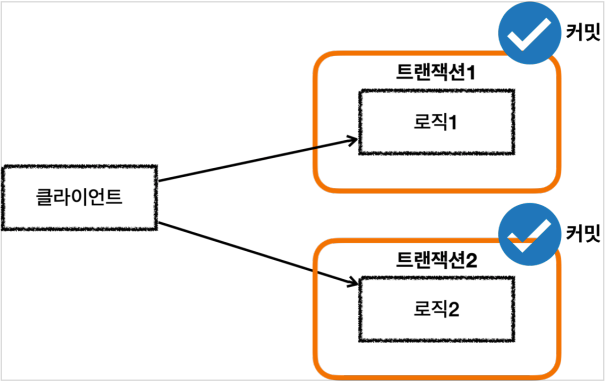

* 트랜잭션1: `Acquired Connection [HikariProxyConnection@1772902226 wrapping conn0]`
* 트랜잭션2: `Acquired Connection [HikariProxyConnection@444211664 wrapping conn0]`

결과적으로 `conn0`을 통해 커넥션이 재사용 된 것을 확인할 수 있고,
`HikariProxyConnection@1772902226`, `HikariProxyConnection@444211664`을 통해 각각 커넥션 풀에서 커넥션을 조회한 것을 확인할 수 있다.

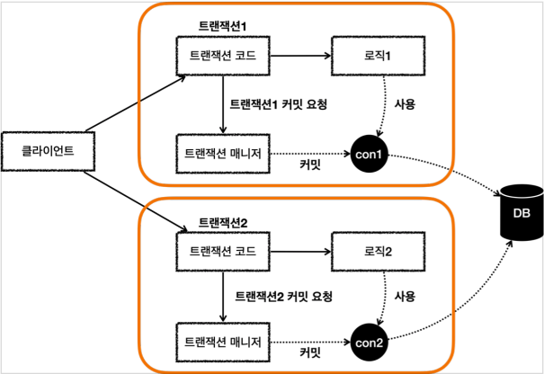

* 트랜잭션이 각각 수행되면서 사용되는 DB 커넥션도 각각 다르다.
* 이 경우 트랜잭션을 각자 관리하기 때문에 전체 트랜잭션을 묶을 수 없다.
    * 예를 들어서 트랜잭션1이 커밋하고, 트랜잭션2가 롤백하는 경우
      트랜잭션1에서 저장한 데이터는 커밋되고, 트랜잭션2에서 저장한 데이터는 롤백된다.

### double_commit_rollback

```java
@Test
void double_commit_rollback() {
    log.info("트랜잭션 1 시작");
    TransactionStatus tx1 = txManager.getTransaction(new DefaultTransactionDefinition());
    log.info("트랜잭션 1 커밋");
    txManager.commit(tx1);

    log.info("트랜잭션 2 시작");
    TransactionStatus tx2 = txManager.getTransaction(new DefaultTransactionDefinition());
    log.info("트랜잭션 2 롤백");
    txManager.rollback(tx2);
}
```

#### 결과 로그

```
h.springdb22.propagation.BasicTxTest     : 트랜잭션 1 시작
o.s.j.d.DataSourceTransactionManager     : Creating new transaction with name [null]: PROPAGATION_REQUIRED,ISOLATION_DEFAULT
o.s.j.d.DataSourceTransactionManager     : Acquired Connection [HikariProxyConnection@1772902226 wrapping conn0: url=jdbc:h2:mem:ece222f5-6dae-4e4e-9e4b-e3a15534f998 user=SA] for JDBC transaction
o.s.j.d.DataSourceTransactionManager     : Switching JDBC Connection [HikariProxyConnection@1772902226 wrapping conn0: url=jdbc:h2:mem:ece222f5-6dae-4e4e-9e4b-e3a15534f998 user=SA] to manual commit
h.springdb22.propagation.BasicTxTest     : 트랜잭션 1 커밋
o.s.j.d.DataSourceTransactionManager     : Initiating transaction commit
o.s.j.d.DataSourceTransactionManager     : Committing JDBC transaction on Connection [HikariProxyConnection@1772902226 wrapping conn0: url=jdbc:h2:mem:ece222f5-6dae-4e4e-9e4b-e3a15534f998 user=SA]
o.s.j.d.DataSourceTransactionManager     : Releasing JDBC Connection [HikariProxyConnection@1772902226 wrapping conn0: url=jdbc:h2:mem:ece222f5-6dae-4e4e-9e4b-e3a15534f998 user=SA] after transaction

h.springdb22.propagation.BasicTxTest     : 트랜잭션 2 시작
o.s.j.d.DataSourceTransactionManager     : Creating new transaction with name [null]: PROPAGATION_REQUIRED,ISOLATION_DEFAULT
o.s.j.d.DataSourceTransactionManager     : Acquired Connection [HikariProxyConnection@444211664 wrapping conn0: url=jdbc:h2:mem:ece222f5-6dae-4e4e-9e4b-e3a15534f998 user=SA] for JDBC transaction
o.s.j.d.DataSourceTransactionManager     : Switching JDBC Connection [HikariProxyConnection@444211664 wrapping conn0: url=jdbc:h2:mem:ece222f5-6dae-4e4e-9e4b-e3a15534f998 user=SA] to manual commit
h.springdb22.propagation.BasicTxTest     : 트랜잭션 2 롤백
o.s.j.d.DataSourceTransactionManager     : Initiating transaction rollback
o.s.j.d.DataSourceTransactionManager     : Rolling back JDBC transaction on Connection [HikariProxyConnection@444211664 wrapping conn0: url=jdbc:h2:mem:ece222f5-6dae-4e4e-9e4b-e3a15534f998 user=SA]
o.s.j.d.DataSourceTransactionManager     : Releasing JDBC Connection [HikariProxyConnection@444211664 wrapping conn0: url=jdbc:h2:mem:ece222f5-6dae-4e4e-9e4b-e3a15534f998 user=SA] after transaction
```

#### 동작 방식

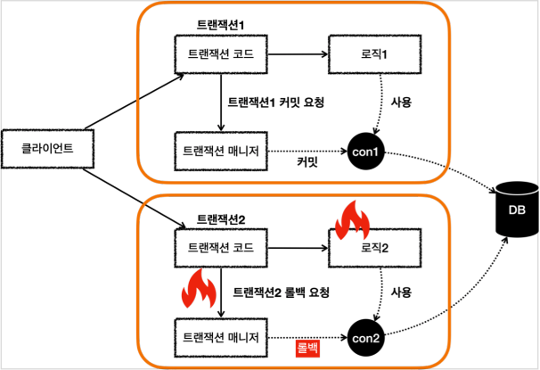

## 전파 기본

### 트랜잭션 전파

* 트랜잭션을 각각 사용하는 것이 아니라, 트랜잭션이 이미 진행중인데, 여기에 추가로 트랜잭션을 수행하면 어떻게 될까?
* 기존 트랜잭션과 별도의 트랜잭션을 진행해야 할까? 아니면 기존 트랜잭션을 그대로 이어 받아서 트랜잭션을 수행해야 할까?
* 이런 경우 어떻게 동작할지 결정하는 것을 트랜잭션 전파(propagation)라 한다.

### 물리 트랜잭션, 논리 트랜잭션

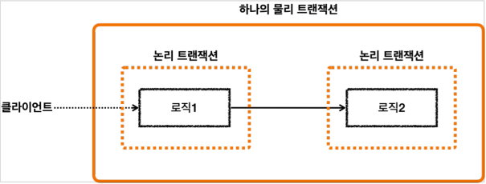

* 스프링은 이해를 돕기 위해 **논리 트랜잭션**과 **물리 트랜잭션**이라는 개념을 나눈다.
* 논리 트랜잭션들은 하나의 물리 트랜잭션으로 묶인다.
* **물리 트랜잭션**은 우리가 이해하는 실제 데이터베이스에 적용되는 트랜잭션을 뜻한다.
    * 실제 커넥션을 통해서 트랜잭션을 시작(`setAutoCommit(false)`)하고, 실제 커넥션을 통해서 커밋, 롤백하는 단위이다.
* **논리 트랜잭션**은 트랜잭션 매니저를 통해 트랜잭션을 사용하는 단위이다.
    * 이러한 논리 트랜잭션 개념은 트랜잭션이 진행되는 중에 내부에 추가로 트랜잭션을 사용하는 경우에 나타난다.
* 단순히 트랜잭션이 하나인 경우 둘을 구분하지는 않는다.

#### 원칙

* 모든 논리 트랜잭션이 커밋되어야 물리 트랜잭션이 커밋된다.
* 하나의 논리 트랜잭션이라도 롤백되면 물리 트랜잭션은 롤백된다.

### 기본 옵션 - REQUIRED

#### 외부 트랜잭션이 수행중인데, 내부 트랜잭션이 추가로 수행됨.

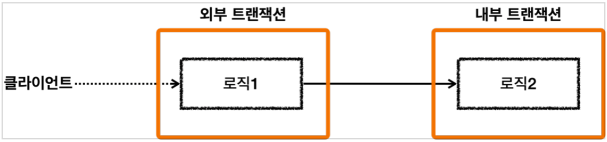

* 외부 트랜잭션이 수행중이고, 아직 끝나지 않았는데, 내부 트랜잭션이 수행된다.
* 외부 트랜잭션이라고 이름 붙인 것은 둘 중 상대적으로 밖에 있기 때문에 외부 트랜잭션이라 한다.
    * 처음 시작된 트랜잭션으로 이해하면 된다.
* 내부 트랜잭션은 외부에 트랜잭션이 수행되고 있는 도중에 호출되기 때문에 마치 내부에 있는 것 처럼 보여서 내부 트랜잭션이라 한다.

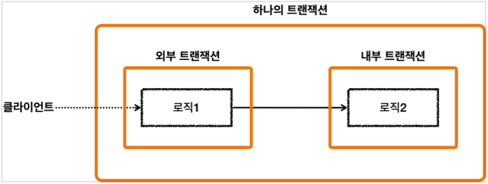

* 스프링은 이 경우 외부 트랜잭션과 내부 트랜잭션을 묶어서 하나의 트랜잭션을 만들어준다.
* 내부 트랜잭션이 외부 트랜잭션에 **참여**하는 것이다.

#### 1, 2 모두 커밋

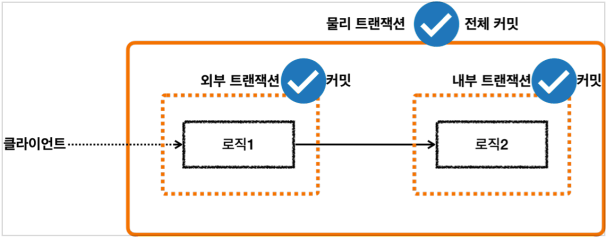

* 모든 논리 트랜잭션이 커밋 되었으므로 물리 트랜잭션도 커밋된다.

#### 둘 중에 하나만 커밋, 하나는 롤백

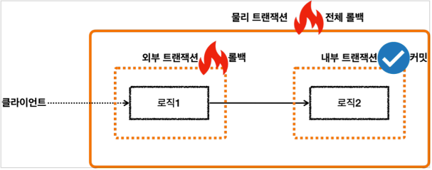

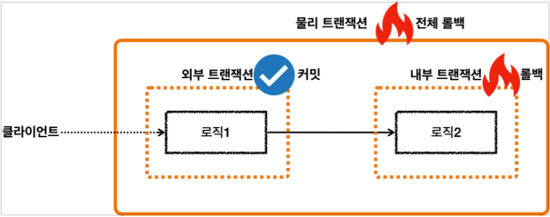

* 논리 트랜잭션이 롤백 되었으므로 물리 트랜잭션은 **모두** 롤백된다.

## 전파 예제


### inner_commit

```java
@Test
void inner_commit() {
    log.info("외부 트랜잭션 시작");
    TransactionStatus outer = txManager.getTransaction(new DefaultTransactionDefinition());
    log.info("outer.isNewTransaction() = {}", outer.isNewTransaction());

    log.info("내부 트랜잭션 시작");
    TransactionStatus inner = txManager.getTransaction(new DefaultTransactionDefinition());
    log.info("inner.isNewTransaction() = {}", inner.isNewTransaction());

    log.info("내부 트랜잭션 커밋");
    txManager.commit(inner);

    log.info("외부 트랜잭션 커밋");
    txManager.commit(outer);
}
```

* 외부 트랜잭션이 수행중인데, 내부 트랜잭션을 추가로 수행했다.
* 외부 트랜잭션은 처음 수행된 트랜잭션이다.
    * 이 경우 신규 트랜잭션 된다.
    * `isNewTransaction = true`
* 내부 트랜잭션은 이미 진행중인 외부 트랜잭션에 참여한다.
    * 이 경우 신규 트랜잭션이 아니다.
    * `isNewTransaction = false`

#### 트랜잭션 참여

* 내부 트랜잭션이 외부 트랜잭션에 참여한다는 뜻은 내부 트랜잭션이 외부 트랜잭션을 그대로 이어 받아서 따른다는 뜻이다.
* 다른 관점으로 보면 외부 트랜잭션의 범위가 내부 트랜잭션까지 넓어진다는 뜻이다.
* 외부에서 시작된 물리적인 트랜잭션의 범위가 내부 트랜잭션까지 넓어진다는 뜻이다.
* 정리하면 외부 트랜잭션과 내부 트랜잭션이 하나의 물리 트랜잭션으로 묶이는 것이다.

#### 결과 로그

```
h.springdb22.propagation.BasicTxTest     : 외부 트랜잭션 시작
o.s.j.d.DataSourceTransactionManager     : Creating new transaction with name [null]: PROPAGATION_REQUIRED,ISOLATION_DEFAULT
o.s.j.d.DataSourceTransactionManager     : Acquired Connection [HikariProxyConnection@1772902226 wrapping conn0: url=jdbc:h2:mem:d3bc1b36-3894-45e8-a62b-e12dc84babbf user=SA] for JDBC transaction
o.s.j.d.DataSourceTransactionManager     : Switching JDBC Connection [HikariProxyConnection@1772902226 wrapping conn0: url=jdbc:h2:mem:d3bc1b36-3894-45e8-a62b-e12dc84babbf user=SA] to manual commit
h.springdb22.propagation.BasicTxTest     : outer.isNewTransaction() = true

h.springdb22.propagation.BasicTxTest     : 내부 트랜잭션 시작
o.s.j.d.DataSourceTransactionManager     : Participating in existing transaction
h.springdb22.propagation.BasicTxTest     : inner.isNewTransaction() = false
h.springdb22.propagation.BasicTxTest     : 내부 트랜잭션 커밋

h.springdb22.propagation.BasicTxTest     : 외부 트랜잭션 커밋
o.s.j.d.DataSourceTransactionManager     : Initiating transaction commit
o.s.j.d.DataSourceTransactionManager     : Committing JDBC transaction on Connection [HikariProxyConnection@1772902226 wrapping conn0: url=jdbc:h2:mem:d3bc1b36-3894-45e8-a62b-e12dc84babbf user=SA]
o.s.j.d.DataSourceTransactionManager     : Releasing JDBC Connection [HikariProxyConnection@1772902226 wrapping conn0: url=jdbc:h2:mem:d3bc1b36-3894-45e8-a62b-e12dc84babbf user=SA] after transaction
```

* `Participating in existing transaction`
    * 내부 트랜잭션을 시작할 때 위의 메시지를 확인할 수 있다.
    * 이 메시지는 내부 트랜잭션이 기존에 존재하는 외부 트랜잭션에 참여한다는 뜻이다.
* `manual commit`
    * 실행 결과를 보면 외부 트랜잭션을 시작하거나 커밋할 때는 DB 커넥션을 통한 물리 트랜잭션을 시작하고, DB 커넥션을 통해 커밋 하는 것을 확인할 수 있다.
    * 그런데 내부 트랜잭션을 시작하거나 커밋할 때는 DB 커넥션을 통해 커밋하는 로그를 전혀 확인할 수 없다.

#### 정리

* 외부 트랜잭션만 물리 트랜잭션을 시작하고, 커밋한다.
    * 만약 내부 트랜잭션이 실제 물리 트랜잭션을 커밋하면 트랜잭션이 끝나버린다.
        * 그렇게 되면, 트랜잭션을 처음 시작한 외부 트랜잭션까지 이어갈 수 없다.
    * 따라서 내부 트랜잭션은 DB 커넥션을 통한 물리 트랜잭션을 커밋하면 안된다.
* 스프링은 이렇게 여러 트랜잭션이 함께 사용되는 경우, 처음 트랜잭션을 시작한 외부 트랜잭션이 실제 물리 트랜잭션을 관리하도록 한다.
    * 이를 통해 트랜잭션 중복 커밋 문제를 해결한다.

### 요청 동작 과정

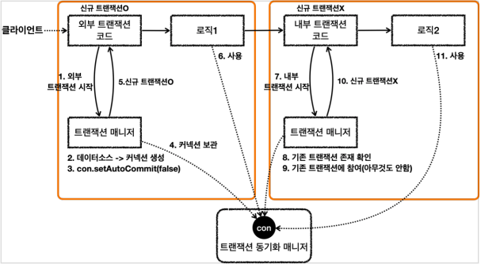

#### 요청 - 외부 트랜잭션

* `txManager.getTransaction()`를 호출해서 외부 트랜잭션을 시작한다.
* 트랜잭션 매니저는 데이터소스를 통해 커넥션을 생성한다.
* 생성한 커넥션을 수동 커밋 모드(`setAutoCommit(false)`)로 설정한다. - **물리 트랜잭션 시작**
* 트랜잭션 매니저는 트랜잭션 동기화 매니저에 커넥션을 보관한다.
* 트랜잭션 매니저는 트랜잭션을 생성한 결과를 `TransactionStatus`에 담아서 반환하는데, 여기에 신규 트랜잭션의 여부가 담겨 있다.
    * `isNewTransaction`를 통해 신규 트랜잭션 여부를 확인할 수 있다.
    * 트랜잭션을 처음 시작했으므로 신규 트랜잭션이다. (`true`)
* 로직 1이 사용되고, 커넥션이 필요한 경우 트랜잭션 동기화 매니저를 통해 트랜잭션이 적용된 커넥션을 획득해서 사용한다.

#### 요청 - 내부 트랜잭션

* `txManager.getTransaction()`를 호출해서 내부 트랜잭션을 시작한다.
* 트랜잭션 매니저는 트랜잭션 동기화 매니저를 통해서 기존 트랜잭션이 존재하는지 확인한다.
* 기존 트랜잭션이 존재하므로 기존 트랜잭션에 참여한다.
    * 기존 트랜잭션에 참여한다는 뜻은 사실 아무것도 하지 않는다는 뜻이다.
    * 이미 기존 트랜잭션인 외부 트랜잭션에서 물리 트랜잭션을 시작했다.
    * 그리고 물리 트랜잭션이 시작된 커넥션을 트랜잭션 동기화 매니저에 담아두었다.
    * 따라서 이미 물리 트랜잭션이 진행중이므로 그냥 두면 이후 로직이 기존에 시작된 트랜잭션을 자연스럽게 사용하게 되는 것이다.
    * 이후 로직은 자연스럽게 트랜잭션 동기화 매니저에 보관된 기존 커넥션을 사용하게 된다.
* 트랜잭션 매니저는 트랜잭션을 생성한 결과를 `TransactionStatus`에 담아서 반환하는데, 여기에서 `isNewTransaction`를 통해 신규 트랜잭션 여부를 확인할 수 있다.
    * 여기서는 기존 트랜잭션에 참여했기 때문에 신규 트랜잭션이 아니다. (`false`)
* 로직 2가 사용되고, 커넥션이 필요한 경우 트랜잭션 동기화 매니저를 통해 외부 트랜잭션이 보관한 커넥션을 획득해서 사용한다.

### 응답 동작 과정

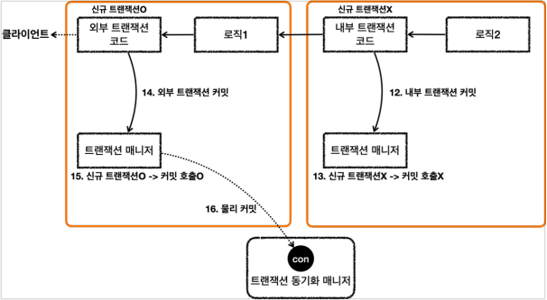

#### 응답 - 내부 트랜잭션

* 로직2가 끝나고 트랜잭션 매니저를 통해 내부 트랜잭션을 커밋한다.
* 트랜잭션 매니저는 커밋 시점에 신규 트랜잭션 여부에 따라 다르게 동작한다.
    * 이 경우 신규 트랜잭션이 아니기 때문에 **실제 커밋을 호출하지 않는다.**
    * 이 부분이 중요한데, 실제 커넥션에 커밋이나 롤백을 호출하면 물리 트랜잭션이 끝나버린다.
    * 아직 트랜잭션이 끝난 것이 아니기 때문에 실제 커밋을 호출하면 안된다.
    * 물리 트랜잭션은 외부 트랜잭션을 종료할 때 까지 이어져야한다.

#### 응답 - 외부 트랜잭션

* 로직1이 끝나고 트랜잭션 매니저를 통해 외부 트랜잭션을 커밋한다.
* 트랜잭션 매니저는 커밋 시점에 신규 트랜잭션 여부에 따라 다르게 동작한다.
    * 외부 트랜잭션은 신규 트랜잭션이다. 따라서 DB 커넥션에 실제 커밋을 호출한다.
* 트랜잭션 매니저에 커밋하는 것이 논리적인 커밋이라면, 실제 커넥션에 커밋하는 것을 물리 커밋이라 할 수 있다.
    * 실제 데이터베이스에 커밋이 반영되고, 물리 트랜잭션도 끝난다.

### 핵심 정리

* 여기서 핵심은 트랜잭션 매니저에 커밋을 호출한다고해서 항상 실제 커넥션에 물리 커밋이 발생하지는 않는다는 점이다.
* 신규 트랜잭션인 경우에만 실제 커넥션을 사용해서 물리 커밋과 롤백을 수행한다.
    * 신규 트랜잭션이 아니면 실제 물리 커넥션을 사용하지 않는다.
* 이렇게 트랜잭션이 내부에서 추가로 사용되면 트랜잭션 매니저에 커밋하는 것이 항상 물리 커밋으로 이어지지 않는다.
    * 그래서 이 경우 논리 트랜잭션과 물리 트랜잭션을 나누게 된다.
    * 또는 외부 트랜잭션과 내부 트랜잭션으로 나누어 설명하기도 한다.
* 트랜잭션이 내부에서 추가로 사용되면, 트랜잭션 매니저를 통해 논리 트랜잭션을 관리하고, 모든 논리 트랜잭션이 커밋되면 물리 트랜잭션이 커밋된다고 이해하면 된다.

## 외부 롤백


### outer_rollback

```java
@Test
void outer_rollback() {
    log.info("외부 트랜잭션 시작");
    TransactionStatus outer = txManager.getTransaction(new DefaultTransactionDefinition());

    log.info("내부 트랜잭션 시작");
    TransactionStatus inner = txManager.getTransaction(new DefaultTransactionDefinition());

    log.info("내부 트랜잭션 커밋");
    txManager.commit(inner);

    log.info("외부 트랜잭션 롤백");
    txManager.rollback(outer);
}
```

#### 실행 결과

```
h.springdb22.propagation.BasicTxTest     : 외부 트랜잭션 시작
o.s.j.d.DataSourceTransactionManager     : Creating new transaction with name [null]: PROPAGATION_REQUIRED,ISOLATION_DEFAULT
o.s.j.d.DataSourceTransactionManager     : Acquired Connection [HikariProxyConnection@1772902226 wrapping conn0: url=jdbc:h2:mem:97c7af5b-7ecc-4694-82c1-e2da33396144 user=SA] for JDBC transaction
o.s.j.d.DataSourceTransactionManager     : Switching JDBC Connection [HikariProxyConnection@1772902226 wrapping conn0: url=jdbc:h2:mem:97c7af5b-7ecc-4694-82c1-e2da33396144 user=SA] to manual commit

h.springdb22.propagation.BasicTxTest     : 내부 트랜잭션 시작
o.s.j.d.DataSourceTransactionManager     : Participating in existing transaction
h.springdb22.propagation.BasicTxTest     : 내부 트랜잭션 커밋

h.springdb22.propagation.BasicTxTest     : 외부 트랜잭션 롤백
o.s.j.d.DataSourceTransactionManager     : Initiating transaction rollback
o.s.j.d.DataSourceTransactionManager     : Rolling back JDBC transaction on Connection [HikariProxyConnection@1772902226 wrapping conn0: url=jdbc:h2:mem:97c7af5b-7ecc-4694-82c1-e2da33396144 user=SA]
o.s.j.d.DataSourceTransactionManager     : Releasing JDBC Connection [HikariProxyConnection@1772902226 wrapping conn0: url=jdbc:h2:mem:97c7af5b-7ecc-4694-82c1-e2da33396144 user=SA] after transaction
```

* 외부 트랜잭션이 물리 트랜잭션을 시작하고 롤백하는 것을 확인할 수 있다.
* 내부 트랜잭션은 앞서 배운대로 직접 물리 트랜잭션에 관여하지 않는다.
* 결과적으로 외부 트랜잭션에서 시작한 물리 트랜잭션의 범위가 내부 트랜잭션까지 사용된다.
    * 이후 외부 트랜잭션이 롤백되면서 전체 내용은 모두 롤백된다.

### 응답 흐름

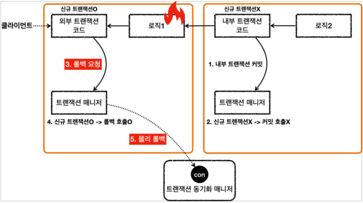

#### 응답 흐름 - 내부 트랜잭션

* 로직2가 끝나고 트랜잭션 매니저를 통해 내부 트랜잭션을 커밋한다.
* 트랜잭션 매니저는 커밋 시점에 신규 트랜잭션 여부에 따라 다르게 동작한다.
    * 이 경우 신규 트랜잭션이 아니기 때문에 실제 커밋을 호출하지 않는다.
    * 이 부분이 중요한데, 실제 커넥션에 커밋이나 롤백을 호출하면 물리 트랜잭션이 끝나버린다.
    * 아직 트랜잭션이 끝난 것이 아니기 때문에 실제 커밋을 호출하면 안된다.
    * 물리 트랜잭션은 외부 트랜잭션을 종료할 때 까지 이어져야한다.

#### 응답 흐름 - 외부 트랜잭션

* 로직1이 끝나고 트랜잭션 매니저를 통해 외부 트랜잭션을 롤백한다.
* 트랜잭션 매니저는 롤백 시점에 신규 트랜잭션 여부에 따라 다르게 동작한다.
    * 외부 트랜잭션은 신규 트랜잭션이다. 따라서 DB 커넥션에 실제 롤백을 호출한다.
* 트랜잭션 매니저에 롤백하는 것이 논리적인 롤백이라면, 실제 커넥션에 롤백하는 것을 물리 롤백이라 할 수 있다.
    * 실제 데이터베이스에 롤백이 반영되고, 물리 트랜잭션도 끝난다.

## 내부 롤백


### inner_rollback

```java
@Test
void inner_rollback() {
    log.info("외부 트랜잭션 시작");
    TransactionStatus outer = txManager.getTransaction(new DefaultTransactionDefinition());
    log.info("outer.isRollbackOnly() = {}", outer.isRollbackOnly());

    log.info("내부 트랜잭션 시작");
    TransactionStatus inner = txManager.getTransaction(new DefaultTransactionDefinition());
    log.info("inner.isRollbackOnly() = {}", inner.isRollbackOnly());

    log.info("내부 트랜잭션 롤백");
    txManager.rollback(inner);
    
    log.info("inner.isRollbackOnly() = {}", inner.isRollbackOnly());
    log.info("outer.isRollbackOnly() = {}", outer.isRollbackOnly());

    log.info("외부 트랜잭션 커밋");
    // txManager.commit(outer);
    assertThatThrownBy(() -> txManager.commit(outer))
                .isInstanceOf(UnexpectedRollbackException.class);
}
```

#### 결과 로그

```
h.springdb22.propagation.BasicTxTest     : 외부 트랜잭션 시작
o.s.j.d.DataSourceTransactionManager     : Creating new transaction with name [null]: PROPAGATION_REQUIRED,ISOLATION_DEFAULT
o.s.j.d.DataSourceTransactionManager     : Acquired Connection [HikariProxyConnection@1772902226 wrapping conn0: url=jdbc:h2:mem:9f893c66-de8c-4b36-a52f-c844c832efab user=SA] for JDBC transaction
o.s.j.d.DataSourceTransactionManager     : Switching JDBC Connection [HikariProxyConnection@1772902226 wrapping conn0: url=jdbc:h2:mem:9f893c66-de8c-4b36-a52f-c844c832efab user=SA] to manual commit
h.springdb22.propagation.BasicTxTest     : outer.isRollbackOnly() = false

h.springdb22.propagation.BasicTxTest     : 내부 트랜잭션 시작
o.s.j.d.DataSourceTransactionManager     : Participating in existing transaction
h.springdb22.propagation.BasicTxTest     : inner.isRollbackOnly() = false

h.springdb22.propagation.BasicTxTest     : 내부 트랜잭션 롤백
o.s.j.d.DataSourceTransactionManager     : Participating transaction failed - marking existing transaction as rollback-only
o.s.j.d.DataSourceTransactionManager     : Setting JDBC transaction [HikariProxyConnection@1772902226 wrapping conn0: url=jdbc:h2:mem:9f893c66-de8c-4b36-a52f-c844c832efab user=SA] rollback-only

h.springdb22.propagation.BasicTxTest     : inner.isRollbackOnly() = true
h.springdb22.propagation.BasicTxTest     : outer.isRollbackOnly() = true

h.springdb22.propagation.BasicTxTest     : 외부 트랜잭션 커밋
o.s.j.d.DataSourceTransactionManager     : Global transaction is marked as rollback-only but transactional code requested commit
o.s.j.d.DataSourceTransactionManager     : Initiating transaction rollback
o.s.j.d.DataSourceTransactionManager     : Rolling back JDBC transaction on Connection [HikariProxyConnection@1772902226 wrapping conn0: url=jdbc:h2:mem:9f893c66-de8c-4b36-a52f-c844c832efab user=SA]
o.s.j.d.DataSourceTransactionManager     : Releasing JDBC Connection [HikariProxyConnection@1772902226 wrapping conn0: url=jdbc:h2:mem:9f893c66-de8c-4b36-a52f-c844c832efab user=SA] after transaction

org.springframework.transaction.UnexpectedRollbackException: Transaction rolled back because it has been marked as rollback-only
```

* 외부 트랜잭션 시작
    * 물리 트랜잭션을 시작한다.
* 내부 트랜잭션 시작
    * `Participating in existing transaction`
    * 기존 트랜잭션에 참여한다.
* 내부 트랜잭션 롤백
    * `Participating transaction failed - marking existing transaction as rollbackonly`
    * 내부 트랜잭션을 롤백하면 실제 물리 트랜잭션은 롤백하지 않는다.
    * 대신에 기존 트랜잭션을 **롤백 전용으로 표시**한다.
* 외부 트랜잭션 커밋
    * 외부 트랜잭션을 커밋한다.
    * `Global transaction is marked as rollback-only`
    * 커밋을 호출했지만, 전체 트랜잭션이 롤백 전용으로 표시되어 있다. 따라서 물리 트랜잭션을 롤백한다.

### 응답 흐름

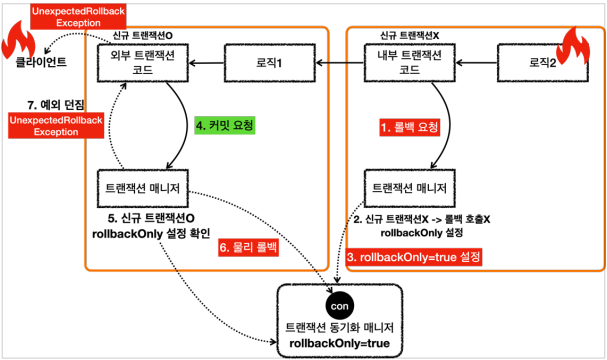

#### 응답 흐름 - 내부 트랜잭션

* 로직 2가 끝나고 트랜잭션 매니저를 통해 내부 트랜잭션을 롤백한다.
    * 로직 2에 문제가 있어서 롤백한다고 가정한다.
* 트랜잭션 매니저는 롤백 시점에 신규 트랜잭션 여부에 따라 다르게 동작한다.
    * 이 경우 신규 트랜잭션이 아니기 때문에 실제 롤백을 호출하지 않는다.
    * 이 부분이 중요한데, 실제 커넥션에 커밋이나 롤백을 호출하면 물리 트랜잭션이 끝나버린다.
    * 아직 트랜잭션이 끝난 것이 아니기 때문에 실제 롤백을 호출하면 안된다.
    * 물리 트랜잭션은 외부 트랜잭션을 종료할 때 까지 이어져야한다.
* 내부 트랜잭션은 물리 트랜잭션을 롤백하지 않는 대신에 트랜잭션 동기화 매니저에 `rollbackOnly = true`라는 표시를 해둔다.

#### 응답 흐름 - 외부 트랜잭션

* 로직1이 끝나고 트랜잭션 매니저를 통해 외부 트랜잭션을 커밋한다.
* 트랜잭션 매니저는 커밋 시점에 신규 트랜잭션 여부에 따라 다르게 동작한다.
    * 외부 트랜잭션은 신규 트랜잭션이다.
    * 따라서 DB 커넥션에 실제 커밋을 호출해야 한다.
    * 이때 먼저 트랜잭션 동기화 매니저에 롤백 전용(`rollbackOnly = true`) 표시가 있는지 확인한다.
    * 롤백 전용 표시가 있으면 물리 트랜잭션을 커밋하는 것이 아니라 롤백한다.
* 실제 데이터베이스에 롤백이 반영되고, 물리 트랜잭션도 끝난다.

* 트랜잭션 매니저에 커밋을 호출한 개발자 입장에서는 분명 커밋을 기대했는데 롤백 전용 표시로 인해 실제로는 롤백이 되어버렸다.
    * 이것은 조용히 넘어갈 수 있는 문제가 아니다.
        * 시스템 입장에서는 커밋을 호출했지만 롤백이 되었다는 것은 분명하게 알려주어야 한다.
    * 예를 들어서 고객은 주문이 성공했다고 생각했는데, 실제로는 롤백이 되어서 주문이 생성되지 않은 것이다.
    * 스프링은 이 경우 `UnexpectedRollbackException` 런타임 예외를 던진다.
        * 그래서 커밋을 시도했지만, 기대하지 않은 롤백이 발생했다는 것을 명확하게 알려준다.

### 정리

* 논리 트랜잭션이 하나라도 롤백되면 물리 트랜잭션은 롤백된다.
* 내부 논리 트랜잭션이 롤백되면 롤백 전용 마크를 표시한다.
* 외부 트랜잭션을 커밋할 때 롤백 전용 마크를 확인한다.
    * 롤백 전용 마크가 표시되어 있으면 물리 트랜잭션을 롤백하고, `UnexpectedRollbackException` 예외를 던진다.

> 참고<br>
> 애플리케이션 개발에서 중요한 기본 원칙은 모호함을 제거하는 것이다. 개발은 명확해야 한다.
> 이렇게 커밋을 호출했는데, 내부에서 롤백이 발생한 경우 모호하게 두면 아주 심각한 문제가 발생한다.
> 이렇게 기대한 결과가 다른 경우 예외를 발생시켜서 명확하게 문제를 알려주는 것이 좋은 설계이다.

## REQUIRES_NEW

## 다양한 전파 옵션